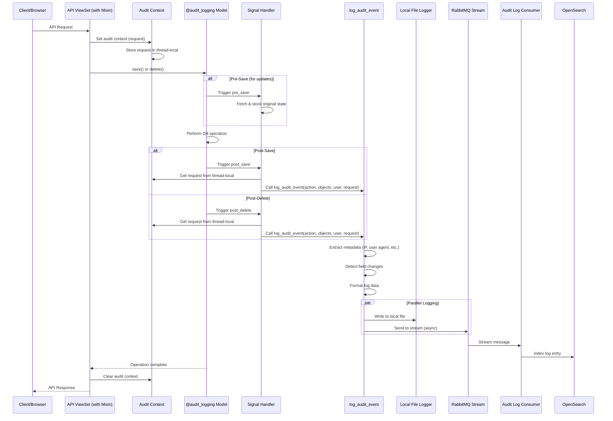

# Audit Logging System

This module provides a comprehensive audit logging solution using RabbitMQ Stream for message queuing and OpenSearch for real-time querying and filtering.

## Architecture

- **Producer**: Logs audit events to RabbitMQ Stream
- **Consumer**: Reads from RabbitMQ Stream and indexes to OpenSearch
- **Storage**: OpenSearch for real-time indexing, fast querying and filtering
- **API**: REST endpoints for searching and filtering audit logs

**Note**: S3 archival is handled by a separate, dedicated service.

## Setup

### 1. RabbitMQ Stream Setup

Enable RabbitMQ Stream plugin:

```bash
# Run rabbitmq container with stream plugin
docker run -d --name rabbitmq \
  -p 5552:5552 \
  -p 15672:15672 \
  -p 5672:5672 \
  -e RABBITMQ_SERVER_ADDITIONAL_ERL_ARGS='-rabbitmq_stream advertised_host localhost' \
  rabbitmq:4-management

# Enable stream plugin
docker exec rabbitmq rabbitmq-plugins enable rabbitmq_stream rabbitmq_stream_management
```

### 2. OpenSearch Setup

You can use either AWS OpenSearch Service or a self-hosted OpenSearch instance.

#### Option A: Docker (for local development)

```bash
# Run OpenSearch (single node for development)
docker run -d --name opensearch \
  -p 9200:9200 \
  -p 9600:9600 \
  -e "discovery.type=single-node" \
  -e "OPENSEARCH_INITIAL_ADMIN_PASSWORD=Admin@123" \
  opensearchproject/opensearch:latest
```

#### Option B: AWS OpenSearch Service

1. Create an OpenSearch domain in AWS
2. Configure access policies
3. Update `.env` with the domain endpoint and credentials

### 3. Environment Configuration

Update your `.env` file with the following settings:

```bash
# OpenSearch settings
OPENSEARCH_HOST=localhost  # or your AWS OpenSearch endpoint
OPENSEARCH_PORT=9200
OPENSEARCH_USERNAME=admin  # if using authentication
OPENSEARCH_PASSWORD=Admin@123  # if using authentication
OPENSEARCH_USE_SSL=false  # true for AWS OpenSearch
OPENSEARCH_VERIFY_CERTS=false  # true for production AWS OpenSearch
OPENSEARCH_INDEX_PREFIX=audit-logs

# RabbitMQ Stream settings
RABBITMQ_STREAM_HOST=localhost
RABBITMQ_STREAM_PORT=5552
RABBITMQ_STREAM_USER=guest
RABBITMQ_STREAM_PASSWORD=guest
RABBITMQ_STREAM_VHOST=/
RABBITMQ_STREAM_NAME=audit_logs_stream
```

### 4. Run Migrations

```bash
python manage.py migrate
```

## Usage

### Starting the Consumer

Run the audit log consumer as a Django management command:

```bash
# Default settings
python manage.py consume_audit_logs

# Custom consumer name (for multiple consumers)
python manage.py consume_audit_logs --consumer-name worker-01
```

The consumer will:
1. Read messages from RabbitMQ Stream
2. Index each log to OpenSearch immediately for real-time search
3. Use RabbitMQ's server-side offset tracking (no database model needed)

### Logging Events

Use the producer to log audit events:

```python
from apps.audit_logging.producer import log_audit_event

log_audit_event(
    user_id="user_123",
    username="john.doe",
    full_name="John Doe",
    action="CREATE",
    object_type="Customer",
    object_id="cus_456",
    object_repr="John Smith",
    change_message="Created new customer",
    ip_address="192.168.1.1",
    user_agent="Mozilla/5.0...",
    session_key="session_key_here"
)
```

### Querying Logs via API

The API provides two endpoints:

1. **Search endpoint** (`/api/audit-logs/search/`) - Returns summary fields for listing
2. **Detail endpoint** (`/api/audit-logs/detail/<log_id>/`) - Returns full log data

#### Search Logs (Summary)

The search endpoint returns a subset of fields suitable for list views:
- `log_id`, `timestamp`, `user_id`, `username`, `full_name`, `action`, `object_type`, `object_id`, `object_repr`

```bash
# Get recent logs
curl -X GET "http://localhost:8000/api/audit-logs/search/" \
  -H "Authorization: Bearer YOUR_TOKEN"

# Filter by user
curl -X GET "http://localhost:8000/api/audit-logs/search/?user_id=user_123" \
  -H "Authorization: Bearer YOUR_TOKEN"

# Filter by date range (from_date/to_date use date format YYYY-MM-DD)
# Dates are interpreted in the app timezone (Asia/Ho_Chi_Minh)
# from_date filters from start of day, to_date filters to end of day
curl -X GET "http://localhost:8000/api/audit-logs/search/?from_date=2024-01-01&to_date=2024-12-31" \
  -H "Authorization: Bearer YOUR_TOKEN"

# Free text search
curl -X GET "http://localhost:8000/api/audit-logs/search/?search_term=customer" \
  -H "Authorization: Bearer YOUR_TOKEN"

# Pagination
curl -X GET "http://localhost:8000/api/audit-logs/search/?page_size=20&from_offset=40" \
  -H "Authorization: Bearer YOUR_TOKEN"
```

#### Get Log Detail

The detail endpoint returns all fields for a specific log:

```bash
# Get full details of a specific log
curl -X GET "http://localhost:8000/api/audit-logs/detail/<log_id>/" \
  -H "Authorization: Bearer YOUR_TOKEN"

# Example with a specific log_id
curl -X GET "http://localhost:8000/api/audit-logs/detail/550e8400-e29b-41d4-a716-446655440000/" \
  -H "Authorization: Bearer YOUR_TOKEN"
```

The detail endpoint returns all fields including:
- `log_id`, `timestamp`, `user_id`, `username`, `full_name`, `action`, `object_type`, `object_id`
- `object_repr`, `change_message`, `ip_address`, `user_agent`, `session_key`

**Note on `change_message` format**: The `change_message` field can be either a string or an object (dict):
- **String format**: Simple message like "Created new object", "Deleted object", "Object modified"
- **Structured format**: For CHANGE actions with field changes, a dictionary containing:
  ```json
  {
    "headers": ["field", "old_value", "new_value"],
    "rows": [
      {"field": "Phone number", "old_value": "0987654321", "new_value": "1234567890"},
      {"field": "Note", "old_value": "old text", "new_value": "new text"}
    ]
  }
  ```
  This allows the frontend to easily display field-level changes in a table format.

## Data Lifecycle

1. **Real-time**: Logs are indexed to OpenSearch immediately for fast querying
2. **Search**: OpenSearch provides queryable audit log data with filtering and search capabilities

## Production Deployment

### Systemd Service (Recommended)

Create `/etc/systemd/system/audit-log-consumer.service`:

```ini
[Unit]
Description=Audit Log Consumer
After=network.target rabbitmq.service opensearch.service

[Service]
Type=simple
User=backend
WorkingDirectory=/path/to/backend
Environment="ENVIRONMENT=production"
ExecStart=/path/to/venv/bin/python manage.py consume_audit_logs
Restart=always
RestartSec=10

[Install]
WantedBy=multi-user.target
```

Enable and start:

```bash
sudo systemctl enable audit-log-consumer
sudo systemctl start audit-log-consumer
sudo systemctl status audit-log-consumer
```

### Monitoring

Monitor the consumer with:

```bash
# Check service status
sudo systemctl status audit-log-consumer

# View logs
sudo journalctl -u audit-log-consumer -f

# Check OpenSearch indices
curl -X GET "http://localhost:9200/_cat/indices/audit-logs-*?v"

# Check RabbitMQ stream
# Access RabbitMQ management UI at http://localhost:15672
```

## Troubleshooting

### Consumer not receiving messages

1. Check RabbitMQ stream plugin is enabled
2. Verify RabbitMQ connection settings in `.env`
3. Check RabbitMQ logs: `docker logs rabbitmq`

### OpenSearch indexing failures

1. Verify OpenSearch is running: `curl http://localhost:9200`
2. Check OpenSearch logs
3. Verify index mapping matches log structure

**Note**: The `change_message` field uses the `flattened` type in OpenSearch mapping (as of the latest update), which supports both string and object/dict values. If you have existing indices created before this update, you may need to:
- Delete old indices and let the consumer recreate them with the new mapping, OR
- Manually update the mapping for existing indices (may require reindexing)

To check the current mapping:
```bash
curl -X GET "http://localhost:9200/audit-logs-*/_mapping"
```

---

## Automatic Audit Logging

### Overview

The audit logging system now includes automatic logging capabilities that capture create, update, and delete operations on Django models with minimal configuration.

### Features

- **Automatic Logging**: Use a simple decorator to enable audit logging on any model
- **Comprehensive Context**: Captures user, IP address, user agent, and session information
- **Change Detection**: Automatically detects and logs field-level changes
- **Flexible Actions**: Supports ADD, CHANGE, DELETE, IMPORT, and EXPORT actions
- **Non-intrusive**: Uses Django signals, so no changes to your save/delete logic needed

### Quick Start

#### 1. Enable Audit Logging on a Model

Simply apply the `@audit_logging` decorator to any Django model:

```python
from django.db import models
from apps.audit_logging import audit_logging

@audit_logging
class Customer(models.Model):
    name = models.CharField(max_length=200)
    email = models.EmailField()
    phone = models.CharField(max_length=20)
```

#### 2. Enable Audit Context in API ViewSets

For audit logging to work in API endpoints, add the `AuditLoggingMixin` to your ViewSet:

```python
from rest_framework import viewsets
from apps.audit_logging import AuditLoggingMixin

class CustomerViewSet(AuditLoggingMixin, viewsets.ModelViewSet):
    queryset = Customer.objects.all()
    serializer_class = CustomerSerializer
```

That's it! All create, update, and delete operations on `Customer` made through this API will now be automatically logged with user context.

**Important**: The mixin must be listed **before** the ViewSet class in the inheritance order.

#### 3. Dependent Models with audit_log_target

For dependent/related models (like EmployeeDependent, EmployeeRelationship), you can specify an `audit_log_target` to log changes under the main model:

```python
from django.db import models
from apps.audit_logging import audit_logging_register

@audit_logging_register
class Employee(models.Model):
    name = models.CharField(max_length=200)
    # ... other fields

@audit_logging_register
class EmployeeDependent(models.Model):
    # Specify the audit log target - changes will be logged under Employee
    audit_log_target = 'hrm.Employee'  # or direct class reference: Employee

    employee = models.ForeignKey(Employee, on_delete=models.CASCADE, related_name='dependents')
    dependent_name = models.CharField(max_length=200)
    relationship = models.CharField(max_length=50)
    # ... other fields
```

**Benefits of audit_log_target:**
- Changes to dependent models are logged under their parent/main model
- Provides clear audit trail showing all changes related to a main object
- Includes source metadata (source_model, source_pk, source_repr) to identify the dependent
- Prevents duplicate logs when cascade deleting the main object
- All dependent changes appear in the main object's history

**How it works:**
- When you create/update/delete an EmployeeDependent, the audit log is recorded under the related Employee
- The log includes metadata showing it came from EmployeeDependent
- If you delete an Employee (cascade deletes dependents), only the Employee delete is logged
- No duplicate logs for cascade-deleted dependents

#### 4. Manual Logging for Custom Actions

For custom actions like IMPORT or EXPORT, use the `log_audit_event` function directly:

```python
from apps.audit_logging import log_audit_event, LogAction

def import_customers_from_excel(request, excel_file):
    # ... import logic ...

    for customer in imported_customers:
        log_audit_event(
            action=LogAction.IMPORT,
            modified_object=customer,
            user=request.user,
            request=request,
            import_source=excel_file.name,
            import_count=len(imported_customers),
        )
```

### How Automatic Logging Works

#### Architecture

1. **ViewSet Mixin**: `AuditLoggingMixin` sets up audit context for API requests
2. **Context Manager**: Stores request in thread-local storage for the duration of the API call
3. **Decorator**: `@audit_logging` registers Django signal handlers for the model
4. **Signal Handlers**: Automatically called when models are created, updated, or deleted
5. **Logging Function**: `log_audit_event` formats and sends the log to RabbitMQ and local files

**Note**: Audit logging only captures changes made through API endpoints where the mixin is applied. This ensures only user actions through the API are logged, not background tasks or admin panel actions.

#### Signal Flow Diagram



#### Logged Information

Each audit log entry contains:

- **Action**: ADD, CHANGE, DELETE, IMPORT, or EXPORT
- **Object Information**:
  - `object_type`: Model name (from AuditLogRegistry)
  - `object_id`: Primary key of the object
  - `object_repr`: String representation of the object
- **User Information**:
  - `user_id`: User's primary key
  - `username`: User's username or email
- **Request Metadata** (when available):
  - `ip_address`: Client IP (respects X-Forwarded-For)
  - `user_agent`: Browser/client user agent
  - `session_key`: Django session key
- **Change Information**:
  - `change_message`: Description of what changed (can be string or structured object)
    - For simple actions (ADD, DELETE): String like "Created new object", "Deleted object"
    - For CHANGE actions with field changes: Structured object with `headers` and `rows` arrays showing field-level changes
  - For CHANGE actions: Field-level diff showing old → new values
- **Timestamps**:
  - `timestamp`: ISO 8601 formatted UTC timestamp
  - `log_id`: Unique UUID for the log entry

### API Reference

#### `@audit_logging` Decorator

Enables automatic audit logging on a Django model.

```python
@audit_logging
class MyModel(models.Model):
    ...
```

**What it logs:**
- CREATE: When a new instance is saved with `created=True`
- UPDATE: When an existing instance is saved with `created=False`
- DELETE: When an instance is deleted

#### `log_audit_event()` Function

Manually log an audit event with standardized parameters.

```python
def log_audit_event(
    action: str,
    original_object=None,
    modified_object=None,
    user=None,
    request: Optional[HttpRequest] = None,
    **extra_kwargs
)
```

**Parameters:**
- `action` (str): Action type (use `LogAction` enum values)
- `original_object`: Original object state (for CHANGE/DELETE)
- `modified_object`: Modified object state (for ADD/CHANGE)
- `user`: User who performed the action
- `request`: HTTP request for extracting metadata
- `**extra_kwargs`: Additional custom fields to log

**Example:**
```python
log_audit_event(
    action=LogAction.EXPORT,
    modified_object=report,
    user=request.user,
    request=request,
    export_format="xlsx",
    export_filters={"date_from": "2024-01-01"},
)
```

#### `LogAction` Enum

Predefined action types:

```python
from apps.audit_logging import LogAction

LogAction.ADD      # Object created
LogAction.CHANGE   # Object updated
LogAction.DELETE   # Object deleted
LogAction.IMPORT   # Object imported from external source
LogAction.EXPORT   # Object exported
```

#### `AuditLogRegistry` Class

Registry for tracking which models have audit logging enabled.

**Class Methods:**

```python
from apps.audit_logging import AuditLogRegistry

# Check if a model is registered
is_registered = AuditLogRegistry.is_registered(MyModel)

# Get all registered models
all_models = AuditLogRegistry.get_all_models()

# Get information about a specific model
model_info = AuditLogRegistry.get_model_info(MyModel)
# Returns: {
#     'app_label': 'myapp',
#     'model_name': 'mymodel',
#     'verbose_name': 'My Model',
#     'verbose_name_plural': 'My Models'
# }

# Get information about all registered models
all_info = AuditLogRegistry.get_all_model_info()

# Get ContentType for a model
content_type = AuditLogRegistry.get_content_type(MyModel)
```

**Automatic Registration:**
Models are automatically registered when decorated with `@audit_logging`:

```python
@audit_logging
class Customer(models.Model):
    name = models.CharField(max_length=200)
    # Model is now registered in AuditLogRegistry
```

**Use Cases:**
- Build admin dashboards showing which models have audit logging
- Programmatically query registered models for monitoring
- Generate documentation of audited models
- Validate audit coverage across your application

#### `batch_audit_context()` Context Manager

For batch operations (import, export, bulk approve, etc.), use `batch_audit_context` to attach batch metadata to individual audit logs. This allows you to:
- Query all logs for a specific object (including batch operations)
- Link all logs from the same batch operation via `batch_id`
- Track errors separately in a summary log

```python
from apps.audit_logging import batch_audit_context, LogAction

with batch_audit_context(
    action=LogAction.IMPORT,
    model_class=Customer,
    user=request.user,
    request=request,
    import_source="customers.xlsx"
) as batch:
    for data in customer_data:
        try:
            customer = Customer.objects.create(**data)
            # Individual log is automatically created with batch metadata
        except Exception as e:
            # Track errors for summary
            batch.add_error(f"Row {data['row']}: {str(e)}")
```

**How it works:**
- Each object gets its own individual audit log
- All logs include `batch_id` and `batch_action` fields to link them together
- Custom fields (e.g., `import_source`) are added to each individual log
- If there are errors, a summary log is created at the end

**Parameters:**
- `action`: The batch action type (e.g., LogAction.IMPORT)
- `model_class`: The model class being operated on
- `user`: User performing the action
- `request`: HTTP request object
- `**extra_fields`: Additional fields (e.g., `import_source`, `export_format`)

**What gets logged for each object:**
- Individual log with all standard fields (action, user, IP, etc.)
- `batch_id`: UUID linking all logs in this batch
- `batch_action`: The batch action type (IMPORT, EXPORT, etc.)
- All extra_fields (e.g., `import_source`, `export_format`)

**Summary log (created only if there are errors):**
- `batch_id`: Same UUID as individual logs
- `batch_summary`: True
- `total_processed`: Count of objects processed
- `error_count`: Number of errors
- `errors`: List of error messages (limited to first 20)

### Advanced Usage

#### Custom Change Messages

Override the automatic change message by providing a custom one:

```python
log_audit_event(
    action=LogAction.CHANGE,
    original_object=old_order,
    modified_object=new_order,
    user=request.user,
    request=request,
    change_message="Order status changed from PENDING to APPROVED",
)
```

#### Logging Without Request Context

If you're logging from a background task or management command:

```python
from django.contrib.auth import get_user_model

User = get_user_model()
system_user = User.objects.get(username="system")

log_audit_event(
    action=LogAction.CHANGE,
    modified_object=obj,
    user=system_user,
    request=None,  # No request available
    automated_task="nightly_data_sync",
)
```

### Integration with Existing Code

#### For New Models

Add the decorator to the model:

```python
from apps.audit_logging import audit_logging

@audit_logging
class NewModel(models.Model):
    ...
```

#### For Existing Models

Add the decorator to existing models:

```python
# Before
class ExistingModel(models.Model):
    ...

# After
from apps.audit_logging import audit_logging

@audit_logging
class ExistingModel(models.Model):
    ...
```

No database migrations needed! The decorator only registers signal handlers.

#### For ViewSets and Views

Add the `AuditLoggingMixin` to your ViewSet:

```python
from apps.audit_logging import AuditLoggingMixin

class CustomerViewSet(AuditLoggingMixin, viewsets.ModelViewSet):
    queryset = Customer.objects.all()  # Customer has @audit_logging
    serializer_class = CustomerSerializer
    # Automatic audit logging on create, update, delete!
```

**Important Notes:**
- The mixin **must** be the first parent class (before ModelViewSet)
- Only operations through this API endpoint will be logged
- Operations from admin panel, management commands, or other code paths won't be logged
- This ensures audit logs only contain user actions from API endpoints

### Best Practices

1. **Apply to Important Models**: Focus on business-critical models like:
   - User accounts and profiles
   - Financial transactions
   - Customer and order data
   - Configuration changes

2. **Don't Over-Log**: Avoid logging:
   - Session data
   - Cache entries
   - Temporary computation results

3. **Use audit_log_target for Dependent Models**:
   - Apply to models that are "owned by" or "part of" another model
   - Examples: EmployeeDependent, EmployeeRelationship, OrderLineItem, etc.
   - This keeps all related changes in one audit trail
   - Prevents duplicate logs from cascade deletes

   ```python
   @audit_logging_register
   class OrderLineItem(models.Model):
       audit_log_target = 'orders.Order'
       order = models.ForeignKey(Order, on_delete=models.CASCADE)
       # ... other fields
   ```

4. **ManyToMany Changes**: ManyToMany relationships are NOT automatically logged.
   - Log M2M changes explicitly where the business logic handles them
   - Example: When adding/removing tags, roles, permissions, etc.

   ```python
   # Example: Logging role assignment
   employee.roles.add(new_role)
   log_audit_event(
       action=LogAction.CHANGE,
       modified_object=employee,
       user=request.user,
       request=request,
       change_message=f"Added role: {new_role}",
   )
   ```

5. **Use Batch Context for Bulk Operations**: Always use `batch_audit_context` for bulk operations to add batch metadata:
   ```python
   # Good - Individual logs with batch metadata for linking
   with batch_audit_context(action=LogAction.IMPORT, model_class=Customer, ...) as batch:
       for data in customer_data:
           try:
               customer = Customer.objects.create(**data)
               # Individual log created with batch_id for linking
           except Exception as e:
               batch.add_error(str(e))

   # Without batch context - Individual logs but no way to link them
   for data in customer_data:
       customer = Customer.objects.create(**data)  # Individual log without batch linkage
   ```

4. **Custom Actions**: Use appropriate LogAction types for different operations:
   ```python
   # Good
   log_audit_event(action=LogAction.IMPORT, ...)

   # Not ideal - creates many individual logs
   for obj in objects:
       obj.save()  # Triggers ADD log for each
   ```

6. **Error Handling**: The logging system silently catches and logs errors to avoid breaking your application. Check logs if audit entries are missing.

### What Changed in the Refactoring

The audit logging system has been refactored to simplify complexity and improve performance:

#### What Was Removed
1. **Automatic ManyToMany Tracking**: M2M field changes are no longer automatically detected and logged in `related_changes`
2. **Automatic Reverse Foreign Key Tracking**: Changes to related objects (inline models) are no longer automatically logged
3. **Recursive Inspection**: The system no longer recursively inspects related objects for field changes

#### What Was Added
1. **audit_log_target Attribute**: Dependent models can declare their target model for logging
2. **Cascade Delete Detection**: Prevents duplicate logs when deleting main objects that cascade to dependents
3. **Source Metadata**: Logs from dependent models include source_model, source_pk, and source_repr

#### Why These Changes
- **Performance**: Eliminated expensive queries to detect M2M and reverse FK changes
- **Clarity**: Makes it explicit where audit logs are recorded
- **Predictability**: Developers can easily control and predict audit logging behavior
- **Reduced Noise**: Cascade deletes no longer create multiple logs

#### Migration Guide
If you were relying on automatic M2M or reverse FK tracking:

**Before (automatic):**
```python
# M2M changes were automatically logged
article.tags.add(tag1, tag2)  # Automatically logged in related_changes
```

**After (explicit):**
```python
# Log M2M changes explicitly where you make them
article.tags.add(tag1, tag2)
log_audit_event(
    action=LogAction.CHANGE,
    modified_object=article,
    user=request.user,
    request=request,
    change_message=f"Added tags: {tag1}, {tag2}",
)
```

**For dependent models:**
```python
# Add audit_log_target to log under parent
@audit_logging_register
class EmployeeDependent(models.Model):
    audit_log_target = 'hrm.Employee'
    employee = models.ForeignKey(Employee, on_delete=models.CASCADE)
    # Now all EmployeeDependent changes log under Employee
```

### Testing

When testing your own models with audit logging:

```python
from unittest.mock import patch
from apps.audit_logging import LogAction

@patch("apps.audit_logging.producer._audit_producer.log_event")
def test_customer_creation_is_logged(mock_log_event):
    customer = Customer.objects.create(name="Test", email="test@example.com")

    # Verify audit log was created
    mock_log_event.assert_called_once()
    call_args = mock_log_event.call_args[1]
    assert call_args["action"] == LogAction.ADD
    assert call_args["object_type"] == "customer"
```
