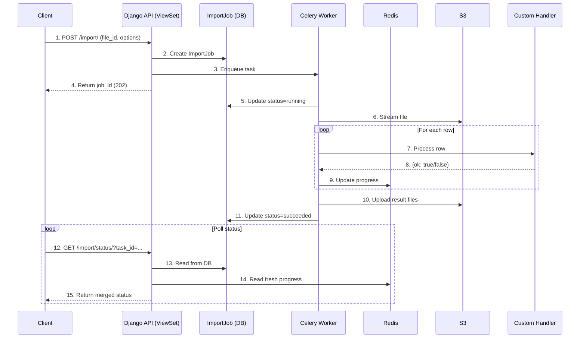

# Async Import Architecture

## System Overview



## Component Architecture

```
┌─────────────────────────────────────────────────────────────┐
│                         Client Layer                         │
│  (Frontend polls /import/status/ for progress updates)      │
└───────────────────────────┬─────────────────────────────────┘
                            │
                            ▼
┌─────────────────────────────────────────────────────────────┐
│                      API Layer (Django)                      │
├─────────────────────────────────────────────────────────────┤
│  • AsyncImportProgressMixin                                  │
│    - POST /import/ (start job)                               │
│    - Validates file_id and handler                           │
│    - Creates ImportJob record                                │
│    - Enqueues Celery task                                    │
│                                                              │
│  • ImportStatusView                                          │
│    - GET /import/status/?task_id=...                        │
│    - Merges DB + Redis data                                  │
│    - Returns unified status                                  │
│                                                              │
│  • AsyncImportCancelMixin                                    │
│    - POST /imports/{job_id}/cancel/                         │
│    - Revokes Celery task                                     │
└───────────────────────────┬─────────────────────────────────┘
                            │
                            ▼
┌─────────────────────────────────────────────────────────────┐
│                   Background Processing                      │
├─────────────────────────────────────────────────────────────┤
│  Celery Task: import_job_task                               │
│  ┌─────────────────────────────────────────────────────┐   │
│  │ 1. Load ImportJob (with DB lock)                     │   │
│  │ 2. Update status to "running"                        │   │
│  │ 3. Resolve handler function                          │   │
│  │ 4. Count total rows (optional)                       │   │
│  │ 5. Initialize streaming readers/writers              │   │
│  │ 6. Process rows in batches:                          │   │
│  │    • Read row from CSV/XLSX stream                   │   │
│  │    • Invoke handler(row_index, row, job_id, opts)   │   │
│  │    • Write to success/failed file                    │   │
│  │    • Update Redis progress every N rows              │   │
│  │    • Update DB every M batches                       │   │
│  │    • Check for cancellation                          │   │
│  │ 7. Upload result files to S3                         │   │
│  │ 8. Create FileModel records                          │   │
│  │ 9. Update job status to "succeeded"                  │   │
│  └─────────────────────────────────────────────────────┘   │
└───────────────────────────┬─────────────────────────────────┘
                            │
                            ▼
┌─────────────────────────────────────────────────────────────┐
│                      Storage Layer                           │
├─────────────────────────────────────────────────────────────┤
│  • PostgreSQL (ImportJob records)                           │
│    - Durable job state                                       │
│    - Progress metrics                                        │
│    - Result file references                                  │
│                                                              │
│  • Redis (Progress cache)                                   │
│    - Real-time progress updates                             │
│    - Key: import:progress:{job_id}                         │
│    - TTL: 24 hours                                          │
│                                                              │
│  • S3 (File storage)                                        │
│    - Source files: uploads/...                              │
│    - Result files: uploads/imports/{job_id}/                │
└─────────────────────────────────────────────────────────────┘
```

## Data Flow

### 1. Import Job Creation

```python
# Client Request
POST /api/employees/import/
{
  "file_id": 123,
  "options": {
    "batch_size": 500,
    "handler_path": "apps.hrm.handlers.employee_import"
  }
}

# Mixin Processing
1. Validate file_id (FileModel.is_confirmed == True)
2. Resolve handler path
3. Create ImportJob record:
   - status = "queued"
   - file = FileModel(123)
   - options = {handler_path, batch_size, ...}
4. Enqueue Celery task
5. Return 202 with import_job_id
```

### 2. Background Processing

```python
# Celery Worker
1. Lock ImportJob (SELECT FOR UPDATE)
2. Update status = "running"
3. Stream file from S3:
   source = S3FileUploadService().stream_file(file_path)
4. For each row:
   - handler_result = handler(row_index, row, job_id, options)
   - if handler_result["ok"]:
       success_writer.write_row(row)
       success_count += 1
   - else:
       failed_writer.write_row(row + [error])
       failure_count += 1
   - Update Redis: {processed_rows, success_count, failure_count}
5. Upload success.csv and failed.csv to S3
6. Create FileModel records
7. Update job status = "succeeded"
```

### 3. Progress Tracking

```python
# Redis Cache (Transient)
Key: "import:progress:{job_id}"
Value: {
  "processed_rows": 2500,
  "total_rows": 10000,
  "success_count": 2480,
  "failure_count": 20,
  "percentage": 25.0,
  "last_updated": "2025-10-22T10:35:00"
}
TTL: 24 hours

# Database (Durable)
ImportJob {
  id: uuid,
  status: "running",
  processed_rows: 2000,  # Updated every N batches
  success_count: 1980,
  failure_count: 20,
  percentage: 20.0,
  ...
}

# Status Endpoint Response (Merged)
GET /import/status/?task_id={job_id}
Returns: {
  ...DB fields...,
  processed_rows: 2500,  # From Redis (fresher)
  success_count: 2480,   # From Redis
  failure_count: 20,     # From Redis
  percentage: 25.0       # From Redis
}
```

## Handler Interface

```python
def import_handler(
    row_index: int,      # 1-based row number
    row: list,           # [col1, col2, col3, ...]
    import_job_id: str,  # UUID of ImportJob
    options: dict        # Import options from request
) -> dict:
    """
    Process a single row.
    
    Returns:
        Success: {"ok": True, "result": {...}}
        Failure: {"ok": False, "error": "message"}
    """
```

### Handler Execution Flow

```
Row Processing Loop
├── Read row from stream
├── Invoke handler(row_index, row, job_id, options)
├── Handler processes row (business logic)
├── Handler returns result
├── If result["ok"] == True:
│   └── Write row to success file
│       Increment success_count
├── Else:
│   └── Write row + error to failed file
│       Increment failure_count
├── Update processed_rows
└── Every N rows:
    ├── Update Redis progress
    └── Every M batches: Update DB
```

## File Streaming Architecture

### Reading Source Files

```
S3 Source File → StreamingReader → Row Iterator
                      │
                      ├─ CSVStreamingReader
                      │  └─ io.TextIOWrapper(S3 bytes stream)
                      │     └─ csv.reader()
                      │
                      └─ XLSXStreamingReader
                         └─ openpyxl.load_workbook(read_only=True)
                            └─ sheet.iter_rows()

Advantages:
• No full file load into memory
• Processes rows one at a time
• Supports files of any size
```

### Writing Result Files

```
Row Data → StreamingWriter → Temp File → S3 Upload
              │
              ├─ CSVStreamingWriter
              │  └─ csv.writer() → temp_file.csv
              │
              └─ XLSXStreamingWriter
                 └─ openpyxl.Workbook(write_only=True)
                    └─ sheet.append() → temp_file.xlsx

Then: Upload temp_file to S3
Finally: Create FileModel record
```

## Error Handling

### Row-Level Errors

```
Row Processing:
├── Try: handler(row)
├── Catch Exception:
│   └── Write to failed file with error message
│       Continue processing next row
└── Success: Write to success file
```

### Job-Level Errors

```
Task Execution:
├── Try: Process all rows
├── Catch Exception:
│   ├── Log stacktrace
│   ├── Set job.status = "failed"
│   ├── Set job.error_message
│   ├── Upload partial result files
│   └── Update progress
└── Success: Set job.status = "succeeded"
```

## Performance Optimization

### Batch Updates

```python
# Update Redis every row (fast)
after_each_row:
    redis.set(progress_key, progress_data)

# Update DB every N batches (slower)
after_every_5_batches:
    job.processed_rows = ...
    job.save()
```

### Memory Efficiency

```
Traditional Approach (Bad):
Load entire file → Parse all rows → Process → Generate results
Memory: O(file_size)

Streaming Approach (Good):
Stream rows → Process one at a time → Stream write results
Memory: O(1) - constant, independent of file size
```

### Cancellation

```python
# Check for cancellation every batch
if job.status == "cancelled" or task.is_aborted():
    # Stop processing
    # Upload partial results
    # Set status = "cancelled"
    # Exit gracefully
```

## Configuration

### Settings Hierarchy

```
1. Django Settings (settings/base/imports.py)
   ├── IMPORT_DEFAULT_BATCH_SIZE = 500
   ├── IMPORT_PROGRESS_DB_FLUSH_EVERY_N_BATCHES = 5
   └── ...

2. ViewSet Class Attributes
   └── import_row_handler = "path.to.handler"

3. Request Options (highest priority)
   ├── batch_size
   ├── handler_path (overrides class attribute)
   ├── count_total_first
   └── custom options for handler
```

## Security Considerations

1. **Authentication**: All endpoints require authentication
2. **Authorization**: Users can only access their own jobs or jobs they have permission for
3. **File Validation**: Only confirmed files can be imported
4. **Handler Resolution**: Handler paths are validated before execution
5. **Input Validation**: All request data validated via serializers
6. **SQL Injection**: Using Django ORM exclusively
7. **Path Traversal**: S3 paths validated and prefixed

## Monitoring

### Key Metrics

- Jobs created per hour
- Jobs succeeded/failed ratio
- Average processing time per row
- Memory usage during import
- Result file sizes
- Error rates by handler

### Logging

```python
logger.info(f"Import job {job_id} started")
logger.info(f"Import job {job_id}: total_rows={total}")
logger.info(f"Import job {job_id}: processed {n} rows")
logger.error(f"Import job {job_id} failed: {error}")
logger.info(f"Import job {job_id} completed: success={s}, failed={f}")
```

## Scalability

### Horizontal Scaling

```
Client Requests
      ↓
Multiple Django API Servers (stateless)
      ↓
Celery Message Queue (Redis/RabbitMQ)
      ↓
Multiple Celery Workers (can scale independently)
      ↓
PostgreSQL (single) + Redis (single/cluster) + S3
```

### Performance Tuning

1. **Adjust batch sizes** based on row complexity
2. **Scale Celery workers** for concurrent imports
3. **Use Redis cluster** for high-throughput progress updates
4. **Optimize handlers** for faster row processing
5. **Use connection pooling** for DB queries in handlers
