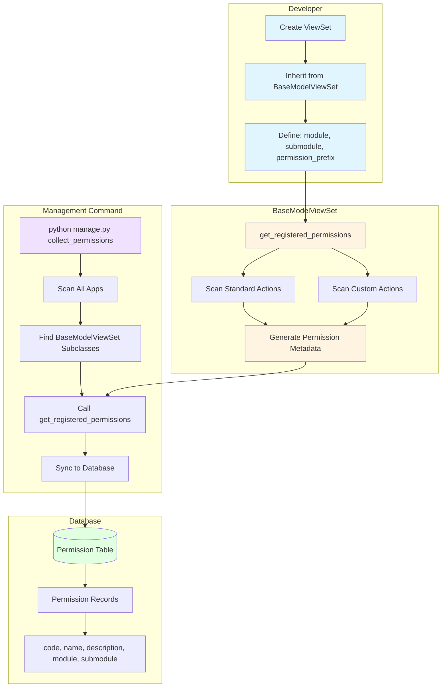
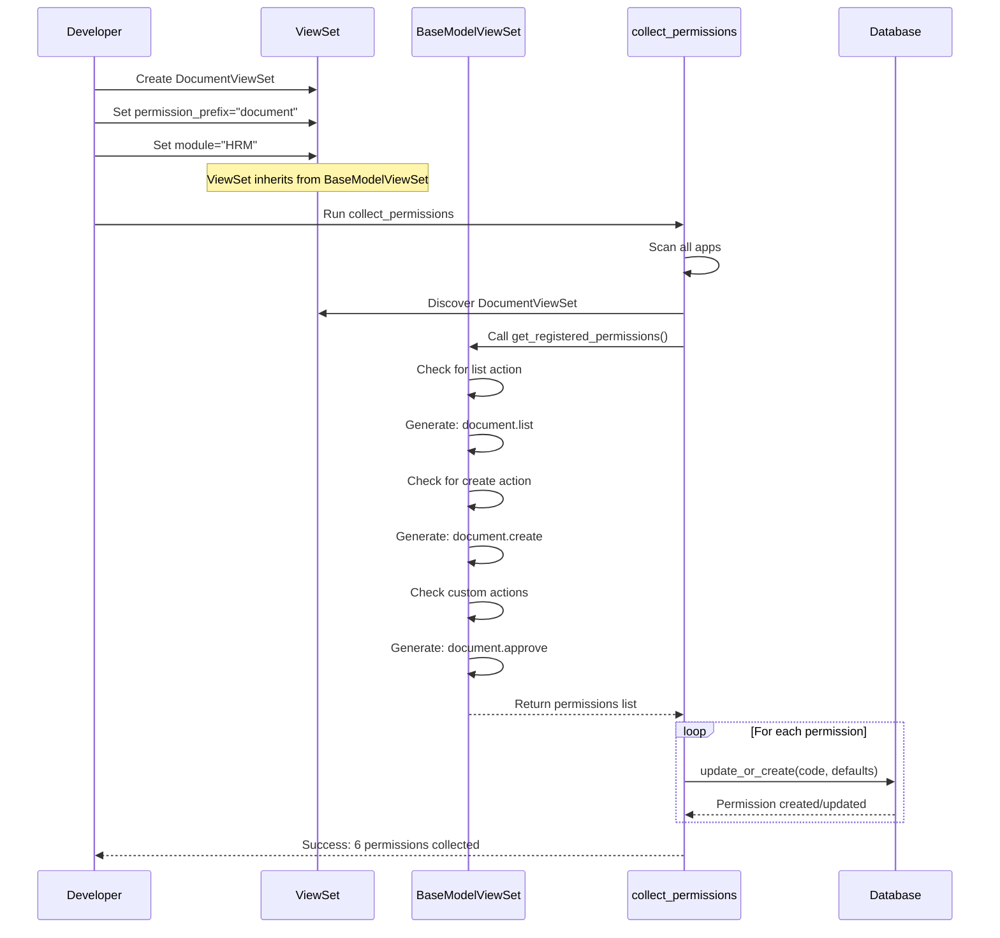

# Auto Permission Registration via BaseModelViewSet

## Overview

This document describes the automatic permission registration system that eliminates the need for manual `@register_permission` decorators on ViewSet methods.

The system automatically generates permission metadata for every `BaseModelViewSet` and `BaseReadOnlyModelViewSet` subclass, which are then collected and synced to the database by the `collect_permissions` management command.

## System Architecture Diagram



## Permission Generation Flow



## Key Benefits

1. **Eliminates Manual Work**: No need to manually decorate each ViewSet action with `@register_permission`
2. **Reduces Errors**: Automatic generation means fewer mistakes in permission codes or metadata
3. **Consistent Naming**: All permissions follow a consistent naming convention
4. **i18n Support**: All permission names and descriptions support internationalization via `gettext_lazy`
5. **Backward Compatible**: Existing decorator-based permissions continue to work

## Architecture

### Base Classes

#### BaseModelViewSet

For ViewSets that need full CRUD operations (Create, Read, Update, Delete).

**Location**: `libs/base_viewset.py`

**Standard Actions Generated**:
- `list` - View list of resources
- `retrieve` - View details of a resource
- `create` - Create a new resource
- `update` - Update a resource
- `partial_update` - Partially update a resource
- `destroy` - Delete a resource

#### BaseReadOnlyModelViewSet

For ViewSets that only need read operations.

**Location**: `libs/base_viewset.py`

**Standard Actions Generated**:
- `list` - View list of resources
- `retrieve` - View details of a resource

### Class Attributes

Each ViewSet that inherits from `BaseModelViewSet` or `BaseReadOnlyModelViewSet` can define:

- `module` (str): The module/system the permissions belong to (e.g., "HRM", "CRM", "Core")
- `submodule` (str): The sub-module within the main module (e.g., "Employee Management", "Document Management")
- `permission_prefix` (str): The prefix for permission codes (e.g., "document", "role", "employee")

**Note**: `permission_prefix` is required. ViewSets without this attribute will not generate any permissions.

## Usage Examples

### Example 1: Simple CRUD ViewSet

```python
from libs import BaseModelViewSet
from apps.core.models import Role
from apps.core.api.serializers import RoleSerializer

class RoleViewSet(BaseModelViewSet):
    """ViewSet for Role model"""

    queryset = Role.objects.all()
    serializer_class = RoleSerializer

    # Permission registration attributes
    module = "Core"
    submodule = "Role Management"
    permission_prefix = "role"
```

**Generated Permissions**:
- `role.list` - List Roles
- `role.retrieve` - View Role
- `role.create` - Create Role
- `role.update` - Update Role
- `role.partial_update` - Partially Update Role
- `role.destroy` - Delete Role

### Example 2: Read-Only ViewSet

```python
from libs import BaseReadOnlyModelViewSet
from apps.core.models import Permission
from apps.core.api.serializers import PermissionSerializer

class PermissionViewSet(BaseReadOnlyModelViewSet):
    """ViewSet for Permission model - Read only"""

    queryset = Permission.objects.all()
    serializer_class = PermissionSerializer

    # Permission registration attributes
    module = "Core"
    submodule = "Permission Management"
    permission_prefix = "permission"
```

**Generated Permissions**:
- `permission.list` - List Permissions
- `permission.retrieve` - View Permission

### Example 3: ViewSet with Custom Actions

```python
from rest_framework.decorators import action
from rest_framework.response import Response
from libs import BaseModelViewSet

class DocumentViewSet(BaseModelViewSet):
    """ViewSet for Document model"""

    queryset = Document.objects.all()
    serializer_class = DocumentSerializer

    # Permission registration attributes
    module = "HRM"
    submodule = "Document Management"
    permission_prefix = "document"

    @action(detail=True, methods=["post"])
    def approve(self, request, pk=None):
        """Approve a document"""
        # Implementation here
        return Response({"status": "approved"})

    @action(detail=False, methods=["get"])
    def statistics(self, request):
        """Get document statistics"""
        # Implementation here
        return Response({"total": 100})
```

**Generated Permissions**:
- `document.list` - List Documents
- `document.retrieve` - View Document
- `document.create` - Create Document
- `document.update` - Update Document
- `document.partial_update` - Partially Update Document
- `document.destroy` - Delete Document
- `document.approve` - Approve Document (custom action)
- `document.statistics` - Statistics Document (custom action)

## Collecting Permissions

### Management Command

Use the `collect_permissions` management command to scan all ViewSets and sync permissions to the database:

```bash
python manage.py collect_permissions
```

**Output Example**:
```
Collecting permissions from views...
Scanning BaseModelViewSet subclasses...
  Found 12 permissions from BaseModelViewSet subclasses
Scanning URL patterns for decorator-based permissions...
Successfully collected 15 permissions (3 created, 12 updated)
```

### What the Command Does

1. **Scans BaseModelViewSet Subclasses**: Iterates through all installed apps, imports their `api.views` modules, and finds all ViewSet classes that inherit from `BaseModelViewSet` or `BaseReadOnlyModelViewSet`

2. **Calls `get_registered_permissions()`**: For each ViewSet found, calls the `get_registered_permissions()` classmethod to get the list of permission metadata

3. **Scans URL Patterns**: Also scans URL patterns for legacy decorator-based permissions (for backward compatibility)

4. **Removes Duplicates**: If the same permission code appears from both sources, the first occurrence is kept

5. **Syncs to Database**: Uses `update_or_create` to insert new permissions or update existing ones with new metadata

### Database Schema

Permissions are stored in the `core_permission` table with the following fields:

- `code` (CharField, unique): Permission code (e.g., "role.list")
- `name` (CharField): Human-readable name (e.g., "List Roles")
- `description` (CharField): Permission description (e.g., "View list of roles")
- `module` (CharField): Module name (e.g., "Core")
- `submodule` (CharField): Submodule name (e.g., "Role Management")

## Internationalization (i18n)

All automatically generated permission names and descriptions support internationalization using Django's `gettext_lazy`.

### Translation Workflow

1. **Define ViewSet** with English strings:
   ```python
   class RoleViewSet(BaseModelViewSet):
       module = "Core"
       submodule = "Role Management"
       permission_prefix = "role"
   ```

2. **Generate Permissions**:
   ```bash
   python manage.py collect_permissions
   ```

3. **Update Translation Files**:
   ```bash
   python manage.py makemessages -l vi --no-obsolete
   ```

4. **Translate in `.po` files**:
   Edit `locale/vi/LC_MESSAGES/django.po` to add Vietnamese translations

5. **Compile Messages**:
   ```bash
   python manage.py compilemessages
   ```

### Translation Examples

The system uses template strings like:
- `_("List {model_name}")` → Vietnamese: `"Danh sách {model_name}"`
- `_("Create {model_name}")` → Vietnamese: `"Tạo {model_name}"`
- `_("Delete {model_name}")` → Vietnamese: `"Xóa {model_name}"`

The `{model_name}` placeholder is automatically replaced with the model's verbose name from `Meta.verbose_name`.

## Backward Compatibility

The system maintains full backward compatibility with the existing `@register_permission` decorator:

### Legacy Decorator Still Works

```python
from apps.core.utils import register_permission
from rest_framework.decorators import api_view

@api_view(["POST"])
@register_permission(
    "document.create",
    "Create document",
    module="Document Management",
    submodule="Documents",
    name="Create Document"
)
def document_create(request):
    # Implementation here
    pass
```

The `collect_permissions` command will find both:
- Permissions from `BaseModelViewSet` subclasses
- Permissions from `@register_permission` decorators

If the same permission code appears in both, the first occurrence is kept (ViewSet permissions are collected first, so they take precedence).

## Migration Guide

### For New ViewSets

Simply inherit from `BaseModelViewSet` or `BaseReadOnlyModelViewSet` and define the three required attributes:

```python
from libs import BaseModelViewSet

class MyViewSet(BaseModelViewSet):
    queryset = MyModel.objects.all()
    serializer_class = MySerializer

    module = "MyModule"
    submodule = "MySubmodule"
    permission_prefix = "mymodel"
```

### For Existing ViewSets

1. **Remove `@register_permission` decorators** from action methods
2. **Change inheritance** from `viewsets.ModelViewSet` to `BaseModelViewSet`
3. **Add the three attributes**: `module`, `submodule`, `permission_prefix`
4. **Run `collect_permissions`** to sync the new permissions

**Before**:
```python
from rest_framework import viewsets
from apps.core.utils import register_permission

class RoleViewSet(viewsets.ModelViewSet):
    queryset = Role.objects.all()
    serializer_class = RoleSerializer

    @register_permission("role.list", "List roles", module="Core", name="List Roles")
    def list(self, request):
        return super().list(request)

    @register_permission("role.create", "Create role", module="Core", name="Create Role")
    def create(self, request):
        return super().create(request)
```

**After**:
```python
from libs import BaseModelViewSet

class RoleViewSet(BaseModelViewSet):
    queryset = Role.objects.all()
    serializer_class = RoleSerializer

    module = "Core"
    submodule = "Role Management"
    permission_prefix = "role"
```

## Testing

### Unit Tests

Located in `apps/core/tests/test_base_viewset_permissions.py`

Run with:
```bash
pytest apps/core/tests/test_base_viewset_permissions.py -v
```

### Integration Tests

The tests verify:
- Permission generation for standard actions
- Permission generation for custom actions
- Correct metadata (module, submodule, name, description)
- Read-only ViewSet generates only read permissions
- ViewSets without `permission_prefix` generate no permissions
- The `collect_permissions` command works correctly

## Troubleshooting

### ViewSet not generating permissions

**Problem**: After adding `BaseModelViewSet`, no permissions are generated.

**Solutions**:
1. Check that `permission_prefix` is defined and not empty
2. Verify the ViewSet is imported in the app's `api.views.__init__.py`
3. Run `collect_permissions` with verbose output to see if the ViewSet is found

### Permission codes conflict

**Problem**: Two ViewSets generate the same permission code.

**Solution**: Ensure each ViewSet has a unique `permission_prefix` value.

### Custom action not generating permission

**Problem**: A custom action decorated with `@action` doesn't generate a permission.

**Solutions**:
1. Verify the action is decorated with `@action` from `rest_framework.decorators`
2. Check that the action name doesn't start with underscore (`_`)
3. Run `collect_permissions` after adding the action

## Advanced Usage

### Customizing Permission Names

If you need to customize the generated permission names, you can override the `get_registered_permissions()` classmethod:

```python
class CustomViewSet(BaseModelViewSet):
    queryset = MyModel.objects.all()
    serializer_class = MySerializer

    module = "Custom"
    submodule = "Custom Management"
    permission_prefix = "custom"

    @classmethod
    def get_registered_permissions(cls):
        # Get default permissions
        permissions = super().get_registered_permissions()

        # Customize specific permission
        for perm in permissions:
            if perm["code"] == "custom.list":
                perm["name"] = "View All Custom Items"
                perm["description"] = "Access to view all custom items in the system"

        return permissions
```

### Excluding Standard Actions

If you want to exclude certain standard actions from permission generation, you can override them in your ViewSet:

```python
class LimitedViewSet(BaseModelViewSet):
    queryset = MyModel.objects.all()
    serializer_class = MySerializer

    module = "Limited"
    submodule = "Limited Management"
    permission_prefix = "limited"

    # Remove destroy action
    http_method_names = ['get', 'post', 'put', 'patch', 'head', 'options']
```

This will prevent the `destroy` permission from being generated.

## FAQ

**Q: Do I need to run `collect_permissions` every time I deploy?**

A: Yes, it's recommended to run `collect_permissions` as part of your deployment process to ensure all permissions are synced.

**Q: Can I still use the old `@register_permission` decorator?**

A: Yes, it's fully backward compatible. Both systems work together.

**Q: What happens if I change a permission code?**

A: The old permission will remain in the database. You'll need to manually delete it if desired.

**Q: How do I add permissions for non-ViewSet views?**

A: Continue using the `@register_permission` decorator for function-based views and non-ViewSet class-based views.

**Q: Does this work with third-party ViewSets?**

A: Only if they inherit from `BaseModelViewSet` or `BaseReadOnlyModelViewSet`. Third-party ViewSets would need to be wrapped or subclassed.

## See Also

- [Django REST Framework ViewSets](https://www.django-rest-framework.org/api-guide/viewsets/)
- [Django REST Framework Actions](https://www.django-rest-framework.org/api-guide/viewsets/#marking-extra-actions-for-routing)
- [Django Internationalization](https://docs.djangoproject.com/en/stable/topics/i18n/)
