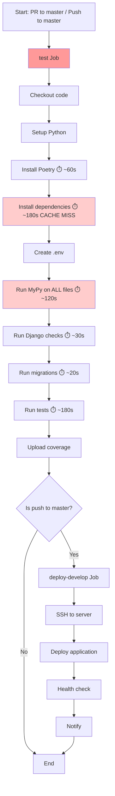
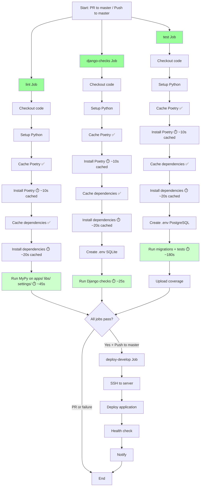

# CI/CD Workflow Comparison

## Before Optimization



**Total Time**: ~12 minutes (without cache)  
**Total Time**: ~8-10 minutes (even with attempted cache, due to bug)

**Issues**:
- ❌ All checks run sequentially
- ❌ Cache key bug prevents dependency caching
- ❌ MyPy scans entire directory including node_modules, .venv
- ❌ PostgreSQL required even for simple Django checks
- ❌ Multiple separate activation steps

---

## After Optimization



**Total Time**: ~3-4 minutes (with cache, parallel execution)  
**Total Time**: ~5-6 minutes (first run, no cache)

**Improvements**:
- ✅ Jobs run in parallel (3 simultaneous jobs)
- ✅ Fixed cache key enables proper dependency caching
- ✅ Poetry installation cached separately
- ✅ MyPy only scans project code
- ✅ Django checks use lightweight SQLite
- ✅ Combined migration + test execution

---

## Performance Comparison Table

| Metric | Before | After | Improvement |
|--------|--------|-------|-------------|
| **First Run (no cache)** | ~12 min | ~5-6 min | **~50% faster** |
| **Cached Run** | ~8-10 min* | ~3-4 min | **~60% faster** |
| **Dependency Install** | ~180s (no cache) | ~20s (cached) | **~89% faster** |
| **MyPy Execution** | ~120s (all files) | ~45s (project only) | **~62% faster** |
| **Django Checks** | ~30s + PG startup | ~25s (SQLite) | **Simpler & faster** |
| **Jobs Running** | 1 sequential | 3 parallel | **3x parallelism** |
| **Cache Reliability** | ❌ Broken | ✅ Working | **Fixed** |

*Note: Before optimization, cache was broken so times include full reinstall

---

## Key Optimization Strategies

### 1. Parallelization
```yaml
jobs:
  lint:      # Runs in parallel ⚡
  django-checks:  # Runs in parallel ⚡
  test:      # Runs in parallel ⚡
  deploy-develop:
    needs: [lint, django-checks, test]  # Waits for all
```

### 2. Proper Caching
```yaml
# Cache Poetry installation (NEW)
- name: Cache Poetry installation
  uses: actions/cache@v4
  with:
    path: |
      ~/.local/share/pypoetry
      ~/.local/bin/poetry
    key: poetry-${{ runner.os }}-${{ hashFiles('**/poetry.lock') }}

# Cache dependencies (FIXED)
- name: Set up Python
  id: setup-python  # ← Fixed: explicit ID
  
- name: Load cached venv
  uses: actions/cache@v4
  with:
    key: venv-${{ runner.os }}-${{ steps.setup-python.outputs.python-version }}-...
    #                                    ↑ Now works correctly!
```

### 3. Focused Execution
```yaml
# Before: python -m mypy . --ignore-missing-imports
# After:
- run: python -m mypy apps/ libs/ settings/ --ignore-missing-imports
```

### 4. Right Tool for the Job
```yaml
# Django checks don't need PostgreSQL
django-checks:
  # No services defined
  steps:
    - name: Create environment file
      run: |
        cat > .env << 'EOF'
        DATABASE_URL=sqlite:///db.sqlite3  # ← Lightweight!
        EOF
```

---

## Developer Experience Impact

### Before
- 👎 Wait ~8-10 minutes for CI feedback
- 👎 Cache doesn't work, dependencies install every time
- 👎 Slow feedback on simple linting errors
- 👎 Can't see which check failed quickly

### After
- 👍 Wait ~3-4 minutes for CI feedback
- 👍 Cache works reliably, dependencies cached
- 👍 Fast feedback on linting (job finishes first)
- 👍 Parallel jobs show which area failed
- 👍 Reduced GitHub Actions minutes cost

---

## Cost Savings

### GitHub Actions Minutes
- **Before**: ~10 min/run × 20 runs/day = **200 minutes/day**
- **After**: ~4 min/run × 20 runs/day = **80 minutes/day**
- **Savings**: **120 minutes/day** or **~3,600 minutes/month** (60% reduction)

For organizations with limited GitHub Actions minutes, this is a significant cost saving!
