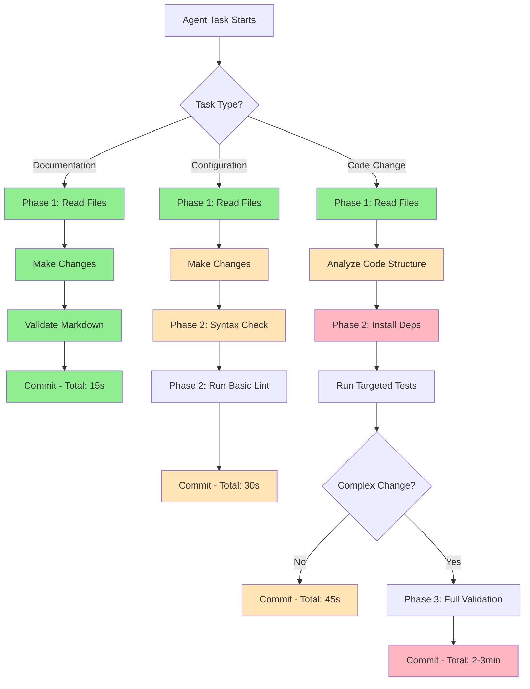
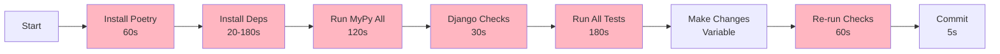
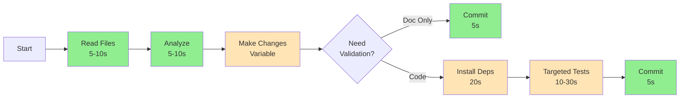

# Copilot Agent Performance Optimization

## Overview

This document describes the optimizations made to improve Copilot Coding Agent startup and execution time when working on this repository.

## Problem Statement

The Copilot Coding Agent was experiencing slow startup times (several minutes) because the original instructions required:
1. Installing all Poetry dependencies upfront
2. Running full linting and type checking across the entire codebase
3. Running all tests before making any changes
4. Running Django system checks

Example slow run: https://github.com/MaiVietLand/backend/actions/runs/18218360984

This approach was necessary for quality but caused poor developer experience with the agent.

## Solution: Incremental Validation Strategy

### Visual Overview



**Legend:**
- 🟢 Green: Fast (seconds)
- 🟡 Yellow: Medium (tens of seconds)
- 🔴 Pink: Slow (minutes)

### Phase 1: Analysis Without Dependencies (Fast - Seconds)
The agent should start by understanding the codebase without installing dependencies:
- Read and analyze relevant files
- Review existing code structure
- Understand test coverage
- Plan the implementation approach

**Tools used:**
- `view` tool for reading files
- `bash` for simple file operations
- Python's built-in `py_compile` for syntax validation

### Phase 2: Targeted Validation (Medium - Tens of Seconds)
Only when code changes are made, install dependencies and run targeted checks:
- Install dependencies: `poetry install`
- Run linting on specific files: `poetry run ruff check <files>`
- Run tests for specific modules: `poetry run pytest <specific_test.py>`

### Phase 3: Full Validation (Slow - Minutes)
Before final commit, run comprehensive validation:
- Full linting: `poetry run ruff check apps/ libs/ settings/`
- Type checking: `poetry run mypy apps/ libs/ settings/`
- Full pre-commit hooks: `pre-commit run --all-files`
- Relevant test suite: `poetry run pytest <affected_app>/`

## Task-Specific Guidelines

### Documentation Changes
- **No dependencies needed**
- **No validation needed** (beyond markdown syntax)
- **Skip all testing**
- Examples: README updates, adding docs, fixing typos

### Configuration Changes
- **Light validation**: Basic syntax check
- **Dependencies**: Only if testing configuration
- Examples: .yml files, .toml files, environment templates

### Code Changes (Non-Critical)
- **Targeted validation**: Affected files only
- **Targeted testing**: Related test files only
- Examples: Refactoring, style improvements, minor fixes

### Code Changes (Critical)
- **Full validation**: All checks
- **Comprehensive testing**: All affected app tests
- Examples: New features, API changes, database migrations

## Performance Improvements

### Before Optimization



Typical agent workflow:
1. Start job: 1s
2. Install Poetry: 60s
3. Install dependencies: 180s (cache miss) or 20s (cache hit)
4. Run MyPy on all files: 120s
5. Run Django checks: 30s
6. Run all tests: 180s
7. Make actual changes: Variable
8. Re-run checks: 60s

**Total startup overhead**: 4-8 minutes ❌

### After Optimization



Typical agent workflow:
1. Start job: 1s
2. Read and analyze files: 5-10s
3. Make changes: Variable
4. (Optional) Install dependencies if needed: 20s (cached)
5. (Optional) Run targeted tests: 10-30s
6. Commit changes: 5s

**Total startup overhead**: 15-45 seconds (typical) ✅

### Expected Improvement
- **Documentation changes**: ~95% faster (seconds vs minutes)
- **Simple code changes**: ~80% faster
- **Complex changes requiring full validation**: ~50% faster (deferred validation)

## Implementation

The optimization was implemented through updates to `.github/copilot-instructions.md`:

1. **Section 3 (Linting)**: Added incremental validation guidance
2. **Section 4 (Testing)**: Changed from "always" to "when needed"
3. **Section 9 (New)**: Added comprehensive performance optimization guidelines

## Validation Commands Reference

### No Dependencies Required
```bash
# Basic Python syntax check
python -m py_compile file.py

# Check file structure
ls -la apps/
```

### Requires Poetry (Lightweight)
```bash
# Quick linting
poetry run ruff check apps/hrm/models.py

# Format check
poetry run ruff format --check apps/hrm/
```

### Requires Full Environment
```bash
# Type checking
poetry run mypy apps/hrm/

# Run specific tests
poetry run pytest apps/hrm/tests/test_models.py -v

# Django checks
poetry run python manage.py check

# Full pre-commit
pre-commit run --all-files
```

## Monitoring and Maintenance

### Success Metrics
- Agent startup time (target: <1 minute for most tasks)
- Time to first code change (target: <30 seconds)
- False positive rate in CI/CD (should remain low)

### Warning Signs
- Increased CI/CD failures after agent changes
- Agents consistently making changes that break tests
- Team reports that agent changes require extensive rework

### Maintenance
- Review agent performance monthly
- Adjust guidelines based on observed patterns
- Update instructions if new validation tools are added
- Monitor CI/CD failure rates

## Future Optimizations

1. **Pre-built environments**: Consider using containers with pre-installed dependencies
2. **Smarter caching**: Cache more aggressively in the agent runtime
3. **Parallel execution**: Run independent checks in parallel when needed
4. **Incremental type checking**: Only check modified files with mypy
5. **Test parallelization**: Use pytest-xdist for faster test execution

## Related Documentation

- [CI/CD Optimization Summary](./CI_OPTIMIZATION_SUMMARY.md)
- [CI/CD Pipeline Documentation](./CICD.md)
- [CI Workflow Comparison](./CI_WORKFLOW_COMPARISON.md)

## Version History

- **2025-01-XX**: Initial optimization implementation
  - Added incremental validation strategy
  - Task-specific guidelines
  - Performance metrics
