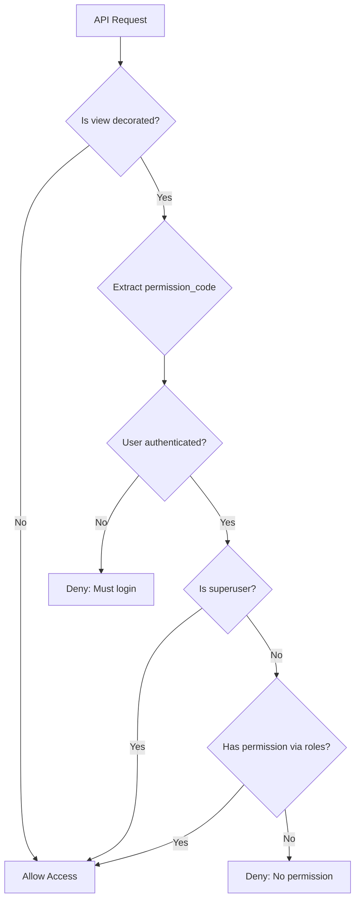

# Permission System Architecture

## System Overview

> **Note (2025-12):** The architecture now relies on `PermissionRegistrationMixin` (e.g., `BaseModelViewSet`, `PermissionedAPIView`) instead of the legacy `@register_permission` decorator. The diagrams below retain the decorator flow for historical context.

```
┌─────────────────────────────────────────────────────────────────┐
│                    Role-Based Permission System                  │
└─────────────────────────────────────────────────────────────────┘

┌──────────────┐     ┌──────────────┐     ┌──────────────┐
│   Developer  │     │     Admin    │     │     User     │
└──────┬───────┘     └──────┬───────┘     └──────┬───────┘
       │                    │                    │
       │ 1. Adds            │ 2. Runs           │ 5. Makes
       │ @register_         │ collect_          │ API request
       │ permission         │ permissions       │
       │                    │                    │
       ▼                    ▼                    ▼
┌─────────────────────────────────────────────────────────────────┐
│                         Django Backend                           │
├─────────────────────────────────────────────────────────────────┤
│                                                                  │
│  ┌────────────────────────────────────────────────────────┐    │
│  │              1. View Definition Layer                   │    │
│  │                                                          │    │
│  │  @register_permission("document.create", "Tạo tài liệu") │    │
│  │  @permission_classes([RoleBasedPermission])             │    │
│  │  def document_create(request):                          │    │
│  │      return Response({"ok": True})                      │    │
│  │                                                          │    │
│  │  Metadata: _permission_code = "document.create"         │    │
│  │            _permission_description = "Tạo tài liệu"     │    │
│  └────────────────────────────────────────────────────────┘    │
│                            ▲                                     │
│                            │                                     │
│                            │ 5. Permission Check                 │
│                            │                                     │
│  ┌────────────────────────────────────────────────────────┐    │
│  │           2. Permission Discovery Layer                 │    │
│  │                                                          │    │
│  │  Management Command: collect_permissions                │    │
│  │  - Scans all URL patterns                               │    │
│  │  - Extracts _permission_code metadata                   │    │
│  │  - Syncs to database                                    │    │
│  │                                                          │    │
│  └─────────────────────┬──────────────────────────────────┘    │
│                        │                                         │
│                        │ Writes                                  │
│                        ▼                                         │
│  ┌────────────────────────────────────────────────────────┐    │
│  │              3. Database Layer                          │    │
│  │                                                          │    │
│  │  ┌──────────────┐                                       │    │
│  │  │  Permission  │                                       │    │
│  │  ├──────────────┤                                       │    │
│  │  │ code         │ ──────┐                               │    │
│  │  │ description  │       │                               │    │
│  │  └──────────────┘       │ M2M                           │    │
│  │         ▲               │                               │    │
│  │         │               ▼                               │    │
│  │         │        ┌──────────────┐                       │    │
│  │         │        │     Role     │                       │    │
│  │         │        ├──────────────┤                       │    │
│  │         │        │ name         │ ◄─────┐               │    │
│  │         │        │ description  │       │ FK            │    │
│  │         │        └──────────────┘       │               │    │
│  │         │               ▲               │               │    │
│  │         │               │               │               │    │
│  │         │               │        ┌──────────────┐       │    │
│  │         │               │        │     User     │       │    │
│  │         │               │        ├──────────────┤       │    │
│  │         │               │        │ username     │       │    │
│  │         │               │        │ email        │       │    │
│  │         │               │        │ role         │───────┘    │
│  │         │               │        │ is_superuser │       │    │
│  │         │               │        └──────────────┘       │    │
│  │         │               │               ▲               │    │
│  │         │ 3. Admin      │ 4. Admin      │               │    │
│  │         │    creates    │    assigns    │               │    │
│  │         │    & assigns  │    role       │               │    │
│  │         │               │               │               │    │
│  └─────────────────────────────────────────────────────────┘    │
│                                              │                   │
│                                              │ 5. Reads          │
│                                              ▼                   │
│  ┌────────────────────────────────────────────────────────┐    │
│  │           4. Authorization Layer                        │    │
│  │                                                          │    │
│  │  RoleBasedPermission.has_permission():                  │    │
│  │                                                          │    │
│  │  1. Extract permission_code from view                   │    │
│  │  2. If no code → ALLOW                                  │    │
│  │  3. If not authenticated → DENY                         │    │
│  │  4. If is_superuser → ALLOW                             │    │
│  │  5. If user.has_permission(code) → ALLOW                │    │
│  │  6. Else → DENY                                         │    │
│  │                                                          │    │
│  │  user.has_permission(code):                             │    │
│  │    if user.role is None:                                │    │
│  │        return False                                     │    │
│  │    return user.role.permissions.filter(                 │    │
│  │        code=code                                        │    │
│  │    ).exists()                                           │    │
│  │                                                          │    │
│  └────────────────────────────────────────────────────────┘    │
│                                                                  │
└─────────────────────────────────────────────────────────────────┘
```

## Data Flow Diagram

```
┌─────────────────┐
│ 1. Code Change  │
│   (Developer)   │
└────────┬────────┘
         │
         ▼
┌─────────────────────────────────────┐
│ View with @register_permission      │
│ - code: "document.create"           │
│ - description: "Tạo tài liệu"       │
└────────┬────────────────────────────┘
         │
         ▼
┌─────────────────────────────────────┐
│ 2. Run collect_permissions          │
│ - Scan URL patterns                 │
│ - Extract metadata                  │
└────────┬────────────────────────────┘
         │
         ▼
┌─────────────────────────────────────┐
│ 3. Database Update                  │
│ Permission.objects.update_or_create │
│ (code, description)                 │
└────────┬────────────────────────────┘
         │
         ▼
┌─────────────────────────────────────┐
│ 4. Admin Setup (Django Admin/Shell) │
│ - Create Role                       │
│ - Assign Permission to Role         │
│ - Assign Role to User               │
└────────┬────────────────────────────┘
         │
         ▼
┌─────────────────────────────────────┐
│ 5. User API Request                 │
│ GET /api/document/create/           │
│ Authorization: Bearer <token>       │
└────────┬────────────────────────────┘
         │
         ▼
┌─────────────────────────────────────┐
│ 6. RoleBasedPermission Check        │
│                                     │
│ ┌───────────────────────────────┐  │
│ │ Extract permission_code       │  │
│ │ from view metadata            │  │
│ └─────────┬─────────────────────┘  │
│           │                         │
│           ▼                         │
│ ┌───────────────────────────────┐  │
│ │ Is authenticated?             │  │
│ └─────────┬─────────────────────┘  │
│           │ Yes                     │
│           ▼                         │
│ ┌───────────────────────────────┐  │
│ │ Is superuser?                 │  │
│ └─────────┬─────────────────────┘  │
│           │ No                      │
│           ▼                         │
│ ┌───────────────────────────────┐  │
│ │ user.has_permission(code)?    │  │
│ │                               │  │
│ │ Query:                        │  │
│ │ SELECT EXISTS(                │  │
│ │   SELECT 1                    │  │
│ │   FROM user_roles             │  │
│ │   JOIN role_permissions       │  │
│ │   WHERE permission.code = ... │  │
│ │   AND user.id = ...           │  │
│ │ )                             │  │
│ └─────────┬─────────────────────┘  │
│           │ Yes                     │
│           ▼                         │
│ ┌───────────────────────────────┐  │
│ │ ALLOW - Execute view          │  │
│ └───────────────────────────────┘  │
└─────────────────────────────────────┘
         │
         ▼
┌─────────────────────────────────────┐
│ 7. Response                         │
│ {"message": "Document created"}     │
└─────────────────────────────────────┘
```

## Database Schema

```sql
-- Permission table
CREATE TABLE core_permission (
    id BIGINT PRIMARY KEY,
    code VARCHAR(100) UNIQUE NOT NULL,
    description VARCHAR(255),
    created_at TIMESTAMP,
    updated_at TIMESTAMP
);

-- Role table
CREATE TABLE core_role (
    id BIGINT PRIMARY KEY,
    name VARCHAR(100) UNIQUE NOT NULL,
    description VARCHAR(255),
    created_at TIMESTAMP,
    updated_at TIMESTAMP
);

-- Role-Permission junction table (Many-to-Many)
CREATE TABLE core_role_permissions (
    id BIGINT PRIMARY KEY,
    role_id BIGINT REFERENCES core_role(id),
    permission_id BIGINT REFERENCES core_permission(id),
    UNIQUE(role_id, permission_id)
);

-- User table now has a ForeignKey to Role (each user has ONE role)
ALTER TABLE core_user ADD COLUMN role_id BIGINT REFERENCES core_role(id) ON DELETE SET NULL;

-- Query to check if user has permission
SELECT EXISTS(
    SELECT 1
    FROM core_user u
    JOIN core_role_permissions rp ON u.role_id = rp.role_id
    JOIN core_permission p ON rp.permission_id = p.id
    WHERE u.id = ?
      AND p.code = ?
);
```

## Permission Check Flow



## Component Interaction

```
┌───────────────────────────────────────────────────────────────┐
│                         Component Stack                        │
├───────────────────────────────────────────────────────────────┤
│                                                                │
│  Application Layer                                             │
│  ├─ Views (FBV, CBV, ViewSets)                                │
│  └─ @register_permission decorator                            │
│                         ↓                                      │
│  Middleware Layer                                              │
│  ├─ DRF Request Processing                                    │
│  ├─ Authentication                                             │
│  └─ RoleBasedPermission.has_permission()                      │
│                         ↓                                      │
│  Business Logic Layer                                          │
│  ├─ User.has_permission(code)                                 │
│  ├─ Role.permissions.all()                                    │
│  └─ Permission queries                                        │
│                         ↓                                      │
│  Data Access Layer                                             │
│  ├─ Django ORM                                                │
│  ├─ Database Queries                                          │
│  └─ Caching (future enhancement)                              │
│                         ↓                                      │
│  Database Layer                                                │
│  ├─ PostgreSQL/SQLite                                         │
│  ├─ Tables: Permission, Role, User                            │
│  ├─ Junction table for Role-Permission M2M                    │
│  └─ ForeignKey from User to Role (one-to-many)                │
│                                                                │
└───────────────────────────────────────────────────────────────┘
```

## Deployment Flow

```
Development          Staging               Production
─────────────────────────────────────────────────────────
    │                    │                      │
    │ 1. Code Review     │                      │
    ├───────────────────►│                      │
    │                    │                      │
    │                    │ 2. Run migrations    │
    │                    │ $ manage.py migrate  │
    │                    │                      │
    │                    │ 3. Collect perms     │
    │                    │ $ collect_permissions│
    │                    │                      │
    │                    │ 4. Setup roles       │
    │                    │ (Django admin)       │
    │                    │                      │
    │                    │ 5. Test APIs         │
    │                    ├─────────────────────►│
    │                    │                      │
    │                    │                      │ 6. Deploy
    │                    │                      │
    │                    │                      │ 7. Run migrations
    │                    │                      │ $ manage.py migrate
    │                    │                      │
    │                    │                      │ 8. Collect perms
    │                    │                      │ $ collect_permissions
    │                    │                      │
    │                    │                      │ 9. Live!
    ▼                    ▼                      ▼
```

## Security Model

```
┌─────────────────────────────────────────────────────────┐
│                    Security Layers                       │
├─────────────────────────────────────────────────────────┤
│                                                          │
│  Layer 1: Authentication                                 │
│  ├─ JWT Token Validation                                │
│  ├─ Session Management                                  │
│  └─ User Identity Verification                          │
│                                                          │
│  Layer 2: Authorization (Role-Based)                    │
│  ├─ Superuser Override (bypass all checks)             │
│  ├─ Role-Permission Mapping                             │
│  └─ Permission Code Matching                            │
│                                                          │
│  Layer 3: View-Level Protection                         │
│  ├─ @register_permission decorator                      │
│  ├─ RoleBasedPermission class                           │
│  └─ Metadata extraction                                 │
│                                                          │
│  Layer 4: Database Integrity                            │
│  ├─ Unique constraints on codes                         │
│  ├─ Foreign key relationships                           │
│  └─ CASCADE delete prevention                           │
│                                                          │
└─────────────────────────────────────────────────────────┘
```

## Performance Considerations

```
┌────────────────────────────────────────────┐
│        Query Optimization Strategy          │
├────────────────────────────────────────────┤
│                                             │
│  Current:                                   │
│  └─ Single JOIN query per request          │
│     SELECT EXISTS(...)                      │
│     Time: ~10-20ms                          │
│                                             │
│  Future Enhancements:                       │
│  ├─ Cache user permissions in Redis        │
│  │  Time: ~1-2ms                            │
│  ├─ Add database indexes                    │
│  │  - Index on permission.code             │
│  │  - Index on user_roles.user_id          │
│  └─ Prefetch related permissions           │
│     Time: ~5ms with caching                 │
│                                             │
└────────────────────────────────────────────┘
```

## Extension Points

```
Current System              Future Extensions
──────────────────────────────────────────────
Permission                  + Object-level permissions
  └─ code                   + Conditional permissions
  └─ description            + Time-based permissions

Role                        + Role hierarchy
  └─ permissions            + Role templates
  └─ users                  + Dynamic roles

User                        + Permission caching
  └─ roles                  + Audit logging
  └─ has_permission()       + Permission analytics
```
