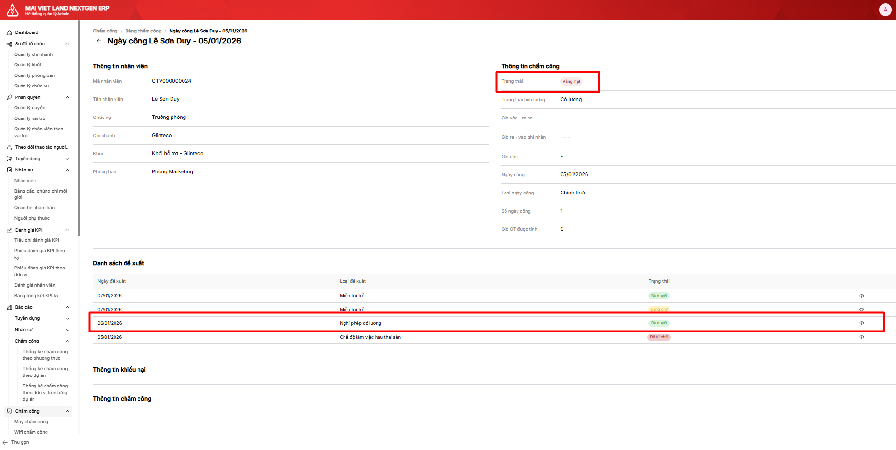
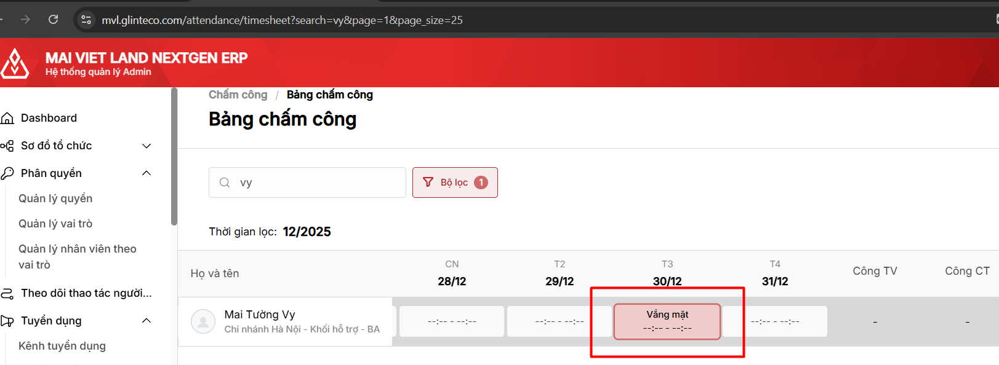
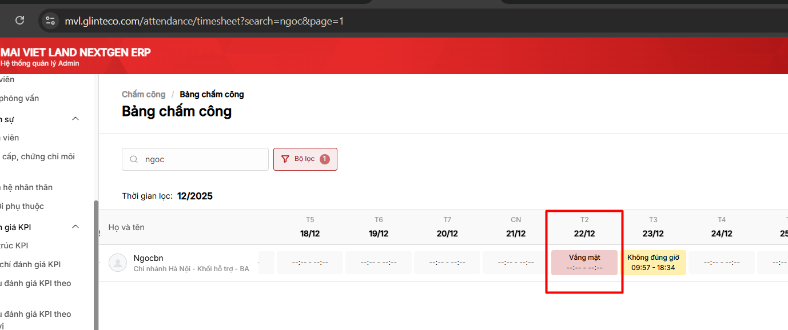
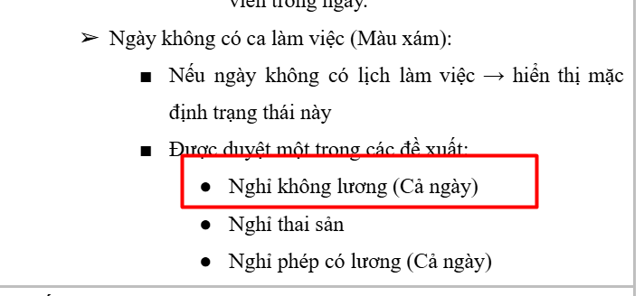

# Duyệt đề xuất nghỉ không lương/có lương (Cả ngày)

## Task Info

| Field | Value |
|-------|-------|
| **Task ID** | 86evyq66n |
| **Status** | 🔴 RE-OPEN |
| **Priority** | 🟠 High |
| **URL** | https://app.clickup.com/t/86evyq66n |
| **Created** | 2024-12-23 |
| **Module** | 9.2. Đề xuất Nghỉ không lương |
| **Folder** | 9. Quản lý quyết định/ đề xuất |
| **Assignees** | TD Hien (hien.trandoan@glinteco.com), Nguyễn Việt Mạnh (manh.nguyenviet@glinteco.com) |
| **Creator** | Nhung Nguyễn (nhungnguyen.neu.ktc@gmail.com) |

---

## Description

Duyệt đề xuất nghỉ không lương: DX000000160
Lỗi tương tự Đề xuất nghỉ phép có lương (DX000000178)

Kiểm tra Hiển thị trạng thái ngày công + đề xuất ở chi tiết ngày công 22/12/2025 của user trên

### Bug

1. **Trạng thái ngày công chưa chính xác:** Màu hồng + Vắng mặt
   - **Expected:** Màu xám, rỗng

2. **Chi tiết ngày công chưa lấy lên thông tin đề xuất**
   - **Solution:** FE xoá params timesheet_entry đi là được

---

## Attachments

**Local files:** [attachments/](attachments/)

| # | Local File | Original URL |
|---|------------|--------------|
| 1 | [86evyq66n-1.png](attachments/86evyq66n-1.png) | [View online](https://t90181237095.p.clickup-attachments.com/t90181237095/cdb3ce8c-b366-45aa-9eee-0b90fcce34bd/image.png) |
| 2 | [86evyq66n-2.png](attachments/86evyq66n-2.png) | [View online](https://t90181237095.p.clickup-attachments.com/t90181237095/02206f83-8fa8-407f-8a00-55eea5687a5c/image.png) |
| 3 | [86evyq66n-3.png](attachments/86evyq66n-3.png) | [View online](https://t90181237095.p.clickup-attachments.com/t90181237095/e4102478-ee71-4451-be0f-752d2dc58a25/image.png) |
| 4 | [86evyq66n-4.png](attachments/86evyq66n-4.png) | [View online](https://t90181237095.p.clickup-attachments.com/t90181237095/25829ea9-08ca-48db-b8d3-a28033a36870/image.png) |
| 5 | [86evyq66n-5.png](attachments/86evyq66n-5.png) | [View online](https://t90181237095.p.clickup-attachments.com/t90181237095/7f1ee728-8d0d-4a23-afcb-115f08f3bf33/image.png) |
| 6 | [86evyq66n-6.png](attachments/86evyq66n-6.png) | [View online](https://t90181237095.p.clickup-attachments.com/t90181237095/9f439d91-f29c-4011-8bdb-f0222d8a639f/image.png) |

### Screenshots








---

## Checklist

- [x] BE update return thêm màu của status (@Nguyễn Việt Mạnh)
- [x] FE update dùng `check_in_time` và `check_out_time` (@Hưng Lê)

---

## Comments (8)

### Comment 1 - Lê Sơn Duy (2025-01-10) ⚠️ CURRENT BUG
> Note: Với ngày công được duyệt "Nghỉ phép có lương": số ngày công = giá trị công tối đa của ngày
>
> **Root Cause Analysis:**
> - Bug nằm trong `timesheet_calculator.py` và `proposal_service.py`
> - `_execute_leave_proposal()` set `status = None` nhưng `compute_working_days()` check `status == ABSENT`
> - → Điều kiện không match → `working_days` không được set đúng
>
> **→ MOVE TO PR1 (Timesheet Calculator)**

---

### Comment 2 - Lê Sơn Duy (2025-01-08)
> Nhân viên đã được setup:
> - Vương Hoa - ngày công 01/01/2026 - Nghỉ phép không lương (Đã duyệt)
> - Vương Hoa - ngày công 02/01/2026 - Nghỉ phép có lương (Đã duyệt)

---

### Comment 3 - Lê Sơn Duy (2025-01-07)
> Bug khi được duyệt đề xuất Nghỉ phép có lương:
>
> **Reality:** Hệ thống hiển thị trạng thái là Vắng
>
> **Expected:** Hệ thống hiển thị trạng thái là rỗng (áp dụng cả màn danh sách và màn chi tiết ngày công)
>
> 
> 

---

### Comment 4 - Hưng Lê (2024-12-28)
> anh @Nguyễn Việt Mạnh check lại đoạn này nhe
> ```json
> "colored_status": {
>     "value": "absent",
>     "variant": "RED"
> },
> ```

---

### Comment 5 - Nhung Nguyễn (2024-12-28)
> C vừa test lại vẫn đang hiển thị màu hồng + vắng mặt: DX000000215
> 

---

### Comment 6 - Hưng Lê (2024-12-24)
> FE update thêm màu r nhé

---

### Comment 7 - Hưng Lê (2024-12-24)
> FE update xong xoá params timesheet_entry
> và update dùng `check_in_time` và `check_out_time`

---

### Comment 8 - Nguyễn Việt Mạnh (2024-12-24)
> FE check lại xoá params timesheet_entry khi call api `proposals/`
>
> ```powershell
> curl 'https://api.mvl.glinteco.com/api/hrm/proposals/?timesheet_entry=2167&page_size=5' \
>   -H 'Accept: */*' \
>   -H 'Accept-Language: vi,en-US;q=0.9,en;q=0.8' \
>   -H 'Authorization: Bearer ...' \
>   ...
> ```

---

*Last updated: Auto-generated from ClickUp*
