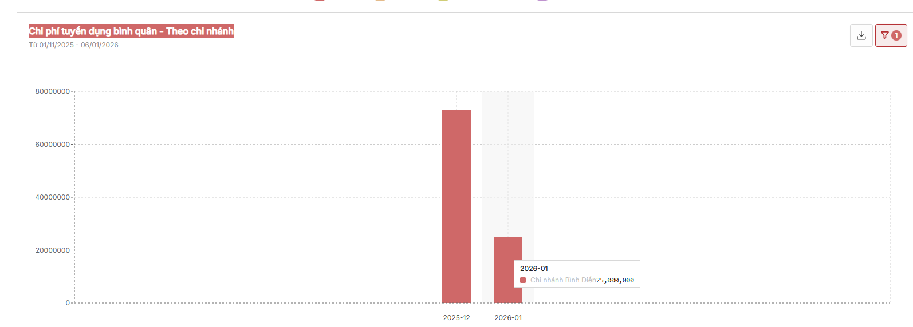
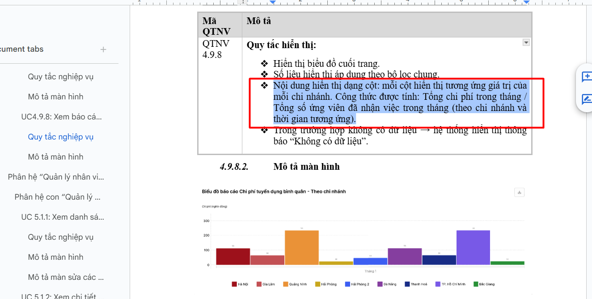

# Biểu đồ Chi phí tuyển dụng bình quân - Theo chi nhánh

## Task Info

| Field | Value |
|-------|-------|
| **Task ID** | 86ew3cqzd |
| **Status** | ✅ RESOLVED (False Alarm) |
| **Priority** | 🟠 High |
| **URL** | https://app.clickup.com/t/86ew3cqzd |
| **Created** | 2025-01-06 |
| **Module** | 4.9. Dashboard |
| **Folder** | 4. Quản lý tuyển dụng |
| **Assignee** | TD Hien (hien.trandoan@glinteco.com) |
| **Creator** | Nhung Nguyễn (nhungnguyen.neu.ktc@gmail.com) |

---

## Description

Kiểm tra biểu đồ

**Bug:** Chưa tính bình quân theo số ứng viên đã nhận việc, mới tổng số tiền

**Expected:** Tính chi phí tuyển dụng bình quân theo số ứng viên đã nhận việc

---

## Attachments

**Local files:** [attachments/](attachments/)

| # | Local File | Original URL |
|---|------------|--------------|
| 1 | [86ew3cqzd-1.png](attachments/86ew3cqzd-1.png) | [View online](https://t90181237095.p.clickup-attachments.com/t90181237095/052dbc6e-8521-4d6d-b337-a3d75d5468a4/image.png) |
| 2 | [86ew3cqzd-2.png](attachments/86ew3cqzd-2.png) | [View online](https://t90181237095.p.clickup-attachments.com/t90181237095/38e984a5-1b0d-4f52-baa0-daed8fad3b4b/image.png) |

### Screenshots




---

## Comments

*No comments*

---

## Resolution (2025-01-13)

**Status:** ✅ False Alarm - FE và BE đã fix trước đó

**Verification:**
```sql
-- RecruitmentCostReport: 73,000,000 VND for branch_id=3
-- HiredCandidateReport: 5 hires for branch_id=3
-- API returns: avg_cost = 14,600,000 (= 73M ÷ 5) ✅ CORRECT
```

---

## Enhancement Request

**Issue:** `avg_cost` trả về giá trị thập phân (e.g., `14600000.0`)

**Enhancement:** Làm tròn `avg_cost` thành số nguyên vì VND không có giá trị lẻ thập phân

**File:** `apps/hrm/api/views/recruitment_dashboard.py`

**Current:**
```python
avg_cost = total_cost / total_hires if total_hires > 0 else 0.0
```

**Expected:**
```python
avg_cost = round(total_cost / total_hires) if total_hires > 0 else 0
```

---

## Time Tracking

- **Time Spent:** 24 minutes 58 seconds

---

*Last updated: Auto-generated from ClickUp*
