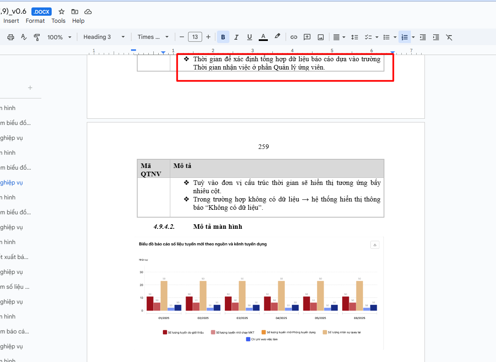
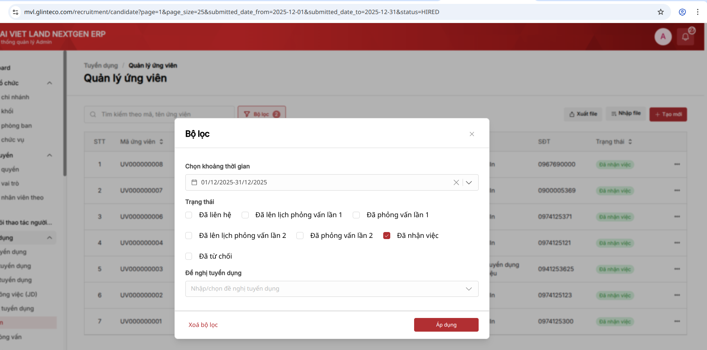
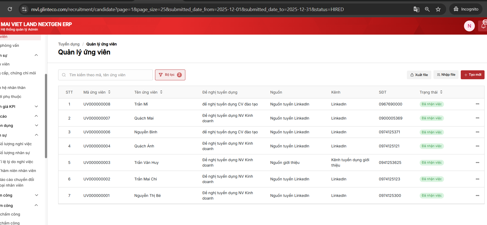

# Biểu đồ Số liệu tuyển mới theo nguồn và kênh TD_Dữ liệu lấy lên chưa chính xác

## Task Info
| Field | Value |
|-------|-------|
| **Task ID** | 86ew3h4bh |
| **Status** | ✅ RESOLVED (False Alarm) |
| **Priority** | high |
| **Assignee** | TD Hien (hien.trandoan@glinteco.com) |
| **Creator** | Nhung Nguyễn |
| **Created** | 2025-01-06 |
| **Module** | 4.9. Dashboard |
| **URL** | https://app.clickup.com/t/86ew3h4bh |

## Description

Chọn thời gian tháng trước( 12/2025)=> Check dữ liệu
Bug: Dữ liệu lấy lên chưa chính xác
Exp:

## Attachments

| # | File |
|---|------|
| 1 |  |
| 2 |  |
| 3 |  |
| 4 |  |

## Resolution (2025-01-13)

**Status:** ✅ False Alarm - Data đã được verify là đúng

**Verification:**
```sql
-- Candidates HIRED trong Dec 2025
SELECT id, code, status, onboard_date, recruitment_source_id
FROM hrm_recruitment_candidate
WHERE onboard_date >= '2025-12-01' AND onboard_date <= '2025-12-31';

 id |    code     | status | onboard_date | recruitment_source_id
----+-------------+--------+--------------+-----------------------
  2 | UV000000002 | HIRED  | 2025-12-11   |                     1
  1 | UV000000001 | HIRED  | 2025-12-12   |                     1
  7 | UV000000007 | HIRED  | 2025-12-01   |                     1
  8 | UV000000008 | HIRED  | 2025-12-16   |                     1
-- Total: 4 candidates

-- RecruitmentSourceReport Dec 2025
SELECT recruitment_source_id, SUM(num_hires) as reported_hires
FROM hrm_recruitmentsourcereport
WHERE report_date >= '2025-12-01' AND report_date <= '2025-12-31'
GROUP BY recruitment_source_id;

 recruitment_source_id | reported_hires
-----------------------+----------------
                     1 |              4
-- Total: 4 hires ✅ MATCHES!
```

**Conclusion:** BE data chính xác. Đã confirm với BA.

## Comments

_No comments_
