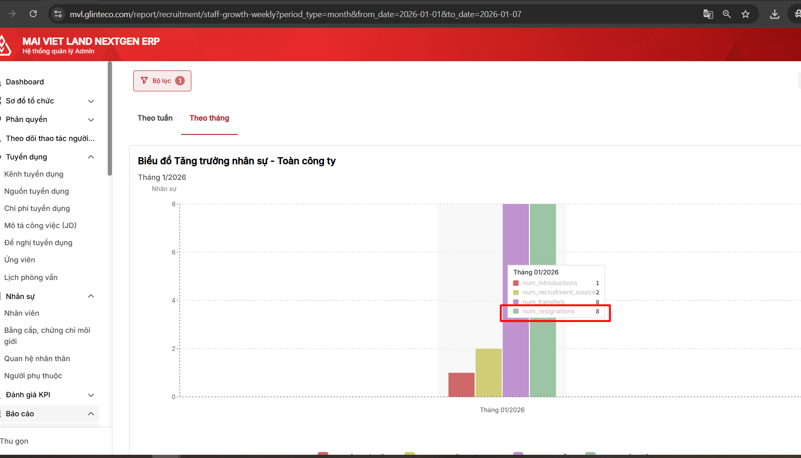

# BC tăng trưởng NS_Nhân sự nghỉ nhiều lần trong thời gian truy vấn đang đếm nhiều lần vào BC

## Task Info
| Field | Value |
|-------|-------|
| **Task ID** | 86ew457ta |
| **Status** | Open |
| **Priority** | - |
| **Assignee** | TD Hien (hien.trandoan@glinteco.com) |
| **Creator** | Nhung Nguyễn |
| **Created** | 2025-01-07 |
| **Module** | 4.8. Báo cáo |
| **Parent Task** | 86ew3ke46 |
| **URL** | https://app.clickup.com/t/86ew457ta |

## Description

Chọn thời gian tháng này( 01/2026), check dữ liệu BC theo tháng
Nhân viên có 2 lần nghỉ việc trong tháng 1

| Mã NV | Tên |
|-------|-----|
| MV000000102 | Nguyen Van An |

Bug: BC đang đếm lên 2 lần nghỉ cho NV trên
Exp: Trong thời gian truy vấn, nếu nhân viên phát sinh nhiều lần nghỉ việc => Chỉ đếm 1 lần

## Attachments

| # | File |
|---|------|
| 1 |  |

## Comments

_No comments_
