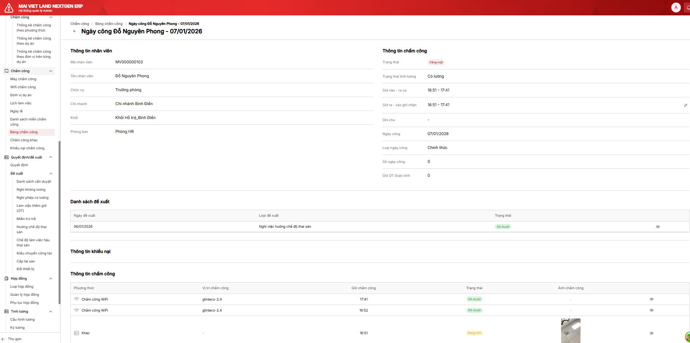

# Thêm logic cho trường hợp: nhân viên đã được duyệt xin nghỉ nhưng vẫn ghi nhận chấm công

## Thông tin task

| Field | Value |
|-------|-------|
| **Task ID** | 86ew4zetx |
| **Status** | Open |
| **Priority** | - |
| **Points** | 8 |
| **Sprint** | Sprint 8 (7/1 - 20/1) |
| **List** | Sprint 8 (7/1 - 20/1) |
| **URL** | https://app.clickup.com/t/86ew4zetx |

## Assignees

- Lê Sơn Duy (duyleson76@gmail.com)
- TD Hien (hien.trandoan@glinteco.com)
- Khoa Nguyễn (khoa.nguyencong@glinteco.com)

## Mô tả

**Flow:** Ngày công của nhân viên được duyệt đề xuất "Nghỉ phép có lương/Nghỉ phép không lương/Nghỉ thai sản" nhưng vẫn ghi nhận log chấm công của nhân viên

**Expected Outcome:**

Với cả 3 đề xuất nghỉ "Nghỉ phép không lương/Nghỉ thai sản/Nghỉ phép có lương", hệ thống tính:
- Số ngày công: như ngày đi làm bình thường (ca làm việc của ngày tương ứng)
- Trạng thái: Đúng giờ hoặc Không đúng giờ (không còn "Vắng" vì hôm đó đã ghi nhận log chấm công của nhân viên)

Với "Nghỉ phép có lương", thêm logic:
- Cộng lại cho nhân viên "Số ngày phép tồn" ngày mà nhân viên xin nghỉ nhưng vẫn đi làm (vẫn có log chấm công)
- Cụ thể: 1 cho ngày 2 ca làm việc và 0,5 cho ngày 1 ca làm việc

## Subtasks

| ID | Name | Status |
|----|------|--------|
| 86ew4zmyx | [BA] Udate SRS cho Logic bảng công: nhân viên đã xin nghỉ nhưng vẫn có log chấm công | Open |

## Attachments

| File | Preview |
|------|---------|
| image.png |  |
