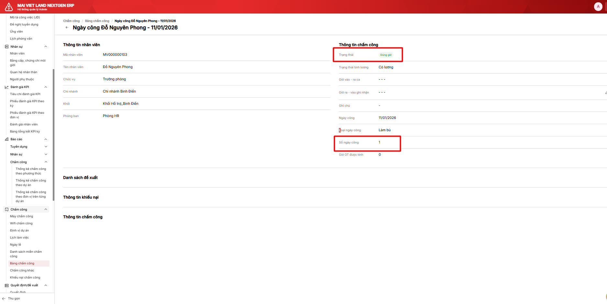

# Bảng chấm công: Lỗi hiển thị ngày tương lai của nhân viên miễn chấm công

## Thông tin task

| Field | Value |
|-------|-------|
| **Task ID** | 86ew50mhq |
| **Status** | Open |
| **Priority** | - |
| **Points** | - |
| **Sprint** | Sprint 8 (7/1 - 20/1) |
| **List** | Sprint 8 (7/1 - 20/1) |
| **URL** | https://app.clickup.com/t/86ew50mhq |

## Assignees

- Lê Sơn Duy (duyleson76@gmail.com)
- TD Hien (hien.trandoan@glinteco.com)

## Mô tả

**Flow:** Tạo ngày làm bù trong tương lai (chỉ làm bù ca sáng)

**Reality:**
- Ngày làm bù hiển thị Trạng thái "Đúng giờ"
- Số ngày công = 1

**Expected Outcome:**

Khi chưa đến ngày làm bù, hệ thống hiển thị ngày công:
- Trạng thái: rỗng
- Số ngày công = 0

Khi đến thời điểm kết thúc ngày làm việc (với TH trong ảnh đã cài đặt làm bù: Ca sáng - ngày 11/01/2026):
- Trạng thái: "Đúng giờ"
- Số ngày công: bằng số ngày công tối đa của ngày làm việc tương ứng

Với TH trong ảnh: ngày 11/01/2026 là 0 (vì 11/01/2026 là ngày chủ nhật làm bù ca sáng, giá trị công tối đa của ngày chỉ có ca làm bù là 0)

## Attachments

| File | Preview |
|------|---------|
| image.png |  |
