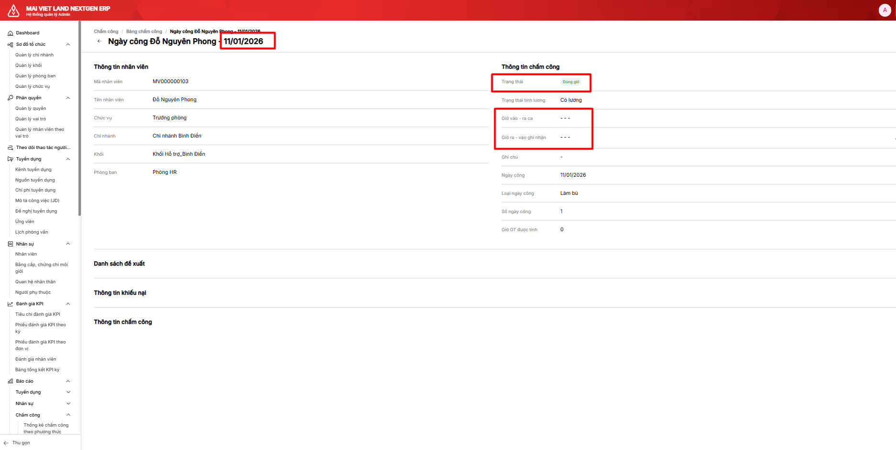

# Thêm Logic cho trường hợp xóa nhân viên miễn chấm công

## Thông tin task

| Field | Value |
|-------|-------|
| **Task ID** | 86ew50tk2 |
| **Status** | Open |
| **Priority** | - |
| **Points** | 8 |
| **Sprint** | Sprint 8 (7/1 - 20/1) |
| **List** | Sprint 8 (7/1 - 20/1) |
| **URL** | https://app.clickup.com/t/86ew50tk2 |

## Assignees

- Lê Sơn Duy (duyleson76@gmail.com)
- TD Hien (hien.trandoan@glinteco.com)

## Mô tả

**Flow:** Tạo mới nhân viên miễn chấm công → Xóa nhân viên miễn chấm công

**Expected Outcome:**
- Ngày nhân viên miễn chấm công được xóa là ngày cuối cùng nhân viên đó được miễn chấm công
- Ảnh được chụp ngày 09/01/2026: nhân viên đã bị xóa khỏi danh sách Miễn chấm công nhưng được trạng thái "Đúng giờ" và Số ngày công = 1

## Attachments

| File | Preview |
|------|---------|
| image.png |  |
