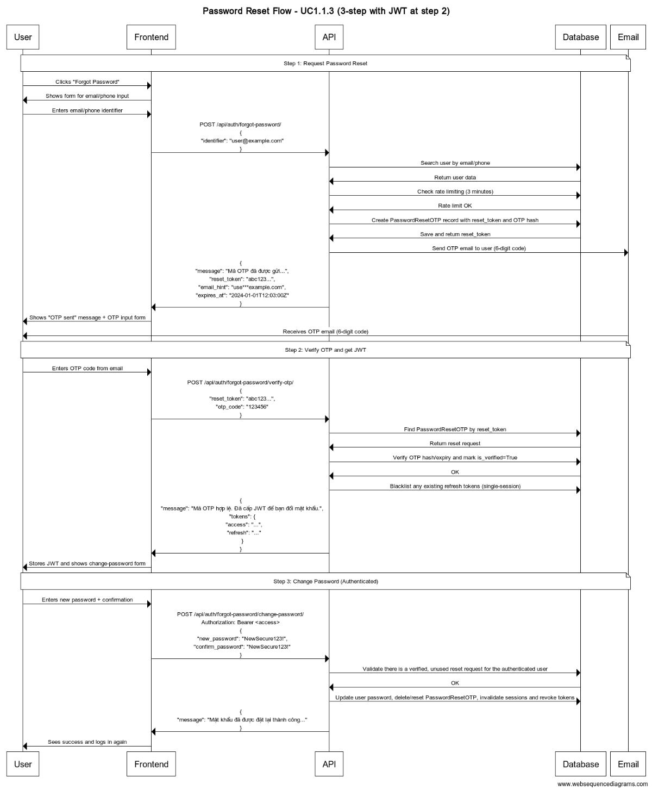

# Password Reset API Sequence Documentation (3-step)

This document describes the UC1.1.3 Password Reset (Forgot Password) flow with 3 steps.

## Web Sequence Diagram

```
title Password Reset Flow - UC1.1.3 (3-step with JWT at step 2)

participant User as User
participant Frontend as Frontend App
participant API as Backend API
participant Database as Database
participant Email as Email Service

Note over User, Email: Step 1: Request Password Reset

User->Frontend: Clicks "Forgot Password"
Frontend->User: Shows form for email/phone input
User->Frontend: Enters email/phone identifier
Frontend->API: POST /api/auth/forgot-password/\n{\n  "identifier": "user@example.com"\n}
API->Database: Search user by email/phone
Database->API: Return user data
API->Database: Check rate limiting (3 minutes)
Database->API: Rate limit OK
API->Database: Create PasswordResetOTP record with reset_token and OTP hash
Database->API: Save and return reset_token
API->Email: Send OTP email to user (6-digit code)
API->Frontend: {\n  "message": "Mã OTP đã được gửi...",\n  "reset_token": "abc123...",\n  "email_hint": "use***example.com",\n  "expires_at": "2024-01-01T12:03:00Z"\n}
Frontend->User: Shows "OTP sent" message + OTP input form
Email->User: Receives OTP email (6-digit code)

Note over User, Email: Step 2: Verify OTP and get JWT

User->Frontend: Enters OTP code from email
Frontend->API: POST /api/auth/forgot-password/verify-otp/\n{\n  "reset_token": "abc123...",\n  "otp_code": "123456"\n}
API->Database: Find PasswordResetOTP by reset_token
Database->API: Return reset request
API->Database: Verify OTP hash/expiry and mark is_verified=True
Database->API: OK
API->Database: Blacklist any existing refresh tokens (single-session)
API->Frontend: {\n  "message": "Mã OTP hợp lệ. Đã cấp JWT để bạn đổi mật khẩu.",\n  "tokens": {\n    "access": "...",\n    "refresh": "..."\n  }\n}
Frontend->User: Stores JWT and shows change-password form

Note over User, Email: Step 3: Change Password (Authenticated)

User->Frontend: Enters new password + confirmation
Frontend->API: POST /api/auth/forgot-password/change-password/\nAuthorization: Bearer <access>\n{\n  "new_password": "NewSecure123!",\n  "confirm_password": "NewSecure123!"\n}
API->Database: Validate there is a verified, unused reset request for the authenticated user
Database->API: OK
API->Database: Update user password, delete/reset PasswordResetOTP, invalidate sessions and revoke tokens
API->Frontend: {\n  "message": "Mật khẩu đã được đặt lại thành công..."\n}
Frontend->User: Sees success and logs in again
```



## API Endpoints

### 1. Request Password Reset

POST /api/auth/forgot-password/

Input:
```
{
  "identifier": "user@example.com"
}
```

Success (200):
```
{
  "message": "Mã OTP đặt lại mật khẩu đã được gửi đến email của bạn. Mã có hiệu lực trong 3 phút.",
  "reset_token": "abcdef123456...",
  "email_hint": "use***example.com",
  "expires_at": "2024-01-01T12:03:00Z",
  "next_request_allowed_at": "2024-01-01T12:03:00Z"
}
```

### 2. Verify OTP (Return JWT)

POST /api/auth/forgot-password/verify-otp/

Input:
```
{
  "reset_token": "abcdef123456...",
  "otp_code": "123456"
}
```

Success (200):
```
{
  "message": "Mã OTP hợp lệ. Đã cấp JWT để bạn đổi mật khẩu.",
  "tokens": {
    "access": "...",
    "refresh": "..."
  }
}
```

### 3. Change Password (Authenticated)

POST /api/auth/forgot-password/change-password/

Headers: Authorization: Bearer <access>

Input:
```
{
  "new_password": "NewSecurePass123!",
  "confirm_password": "NewSecurePass123!"
}
```

Success (200):
```
{
  "message": "Mật khẩu đã được đặt lại thành công. Tất cả phiên đăng nhập cũ đã bị đăng xuất."
}
```

## Security Notes

- Rate limiting: 3 minutes between reset requests
- OTP expiry: 3 minutes; max 5 attempts per request
- Step 2 blacklists previous refresh tokens (single-session)
- Step 3 deletes the reset record, invalidates sessions, and revokes tokens
- Strong password validation enforced
